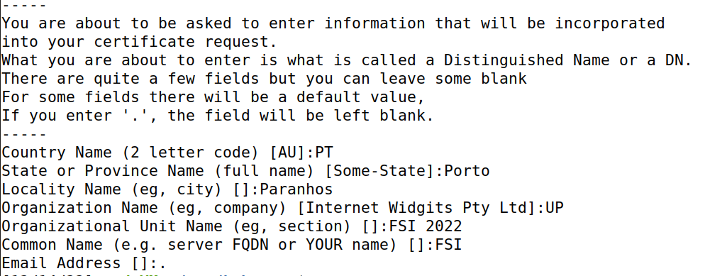
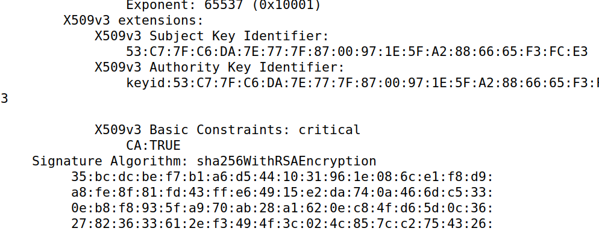
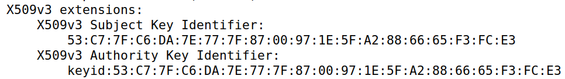

# Trabalho realizado na semana #7

<br>

# SEED Labs - Format String Attack Lab

## Preparation

To prepare our systems for this lab, we followed the Environment Setup section of the guide:

1. Add the following entry to the `/etc/hosts` file of your VM.

    ```
    10.9.0.80 www.fsi2022.com
    ```

<br>

## Task 1 : Becoming a Certificate Authority (CA)

In this task, we will create a new Certificate Authority.
To do so, we followed these steps, inside the `Labsetup/` folder:

1. Configure OpenSSL

    - Copy `/usr/lib/ssl/openssl.cnf` to the current working directory, by using `cp /usr/lib/ssl/openssl.cnf .`

    - In the newly created `openssl.cnf` file, uncomment the `unique_subject` setting in the `[CA_default]` section:

        ```toml
        [CA_default]
        ...
        unique_subject	= no    # Set to 'no' to allow creation of several certs with same subject.
        ```

    - Create the `demoCA/` and `demoCA/newcerts` directories, using `mkdir -p demoCA/newcerts`

    - Create the `demoCA/index.txt` database, using `touch demoCA/index.txt`
    
    - Create the `serial` file, using `echo 1337 > demoCA/serial`

2. Generate the root CA certificate, using `openssl req -x509 -newkey rsa:4096 -sha256 -days 3650 -keyout ca.key -out ca.crt`

    - Type anything in the pass phrase field. We used `rootca`.

    - We used the following information in the certificate:

        

The CA's certificate will be named `ca.crt` and its private key will be named `ca.key`.
We can inspect the certificate's or the key's content using `openssl x509 -in <file> -text -noout`.

### What part of the certificate indicates this is a CA’s certificate?

By analysing the certificate, using `openssl x509 -in ca.crt -text -noout`, we can see that on the section `Certificate > Data > X509v3 extensions > X509v3 Basic Constraints`, there is a property called `CA` that identifies if that certificate belongs to a CA or not.



### What part of the certificate indicates this is a self-signed certificate?

By analysing the certificate, using `openssl x509 -in ca.crt -text -noout`, we can see that on the section `X509v3 extensions`, there are two key identifiers: the Subject Key Identifier and the Authority Key Identifier.
Since both of them are equal, it means that the authority is the subject and, as such, that certificate is self-signed.



### In the RSA algorithm, we have a public exponent e, a private exponent d, a modulus n, and two secret numbers p and q, such that n = pq. Please identify the values for these elements in your certificate and key files.

By analysing the key file, using `openssl x509 -in ca.key -text -noout`, we can determine that:

- the public exponent, `e`, is in the section `publicExponent`

    

- the private exponent `d`, is in the section `privateExponent`

    

- the modulus, `n`, is in the section `modulus`

    

- the two secret numbers, `p` and `q`, are in the sections `prime1` and `prime2` 

    
    

<br>

## Task 2 : Generating a Certificate Request for Your Web Server

In this task, we will be generating a Certificate Request for our web server.
To do that, we executed the following steps:

1. Generate a Certificate Signing Request (CSR), using `openssl req -newkey rsa:2048 -sha256 -keyout server.key -out server.csr -subj "/CN=www.fsi2022.com/O=L02G06 INC./C=PT" -passout pass:dees - -addext "subjectAltName = DNS:www.fsi2022.com, DNS:www.fsi2022A.com, DNS:www.fsi2022B.com"`

    - This will generate a CSR for the domain `www.fsi2022.com`. There are also some alternative names attached to the request, meaning that the generated certificate will also work with the domains `www.fsi2022A.com` and `www.fsi2022B.com`.


<br>

## Task 3 : Modifying the Server Program’s Memory

In this task, we will be generating the certificate requested by the CSR created in the previous task.
To do so, we followed these steps:

1. In the `openssl.cnf` file, uncomment the following line:

    ```toml
    [CA_default]
    ...
    copy_extensions = copy
    ```

2. Create the certificate, using `openssl ca -config openssl.cnf -policy policy_anything -md sha256 -days 3650 -in server.csr -out server.crt -batch -cert ca.crt -keyfile ca.key`

    - This will create a `server.crt` certificate file for the server signed by our root CA.

    <br>

3. Use the command `openssl x509 -in server.crt -text -noout` and check if the Subject Alternative Names from Task 2 were included.

## Task 4 : Deploying Certificate in an Apache-Based HTTPS Website


<br>
<br>
<br>

# CTF

## CTF - Desafio 1

## CTF - Desafio 2
