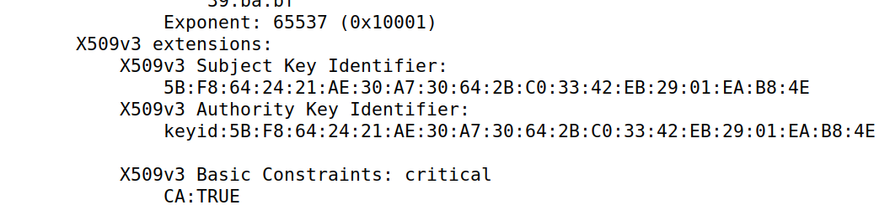

# Trabalho realizado na semana #7

<br>

# SEED Labs - Format String Attack Lab

## Preparation

To prepare our systems for this lab, we followed the Environment Setup section of the guide:

1. Add the following entry to the `/etc/hosts` file of your VM.

    ```
    10.9.0.80 www.fsi2022.com
    ```

<br>

## Task 1 : Becoming a Certificate Authority (CA)

In this task, we will create a new Certificate Authority.
To do so, we followed these steps, inside the `Labsetup/` folder:

1. Configure OpenSSL

    - Copy `/usr/lib/ssl/openssl.cnf` to the current working directory, by using `cp /usr/lib/ssl/openssl.cnf .`

    - In the newly created `openssl.cnf` file, uncomment the `unique_subject` setting in the `[CA_default]` section:

        ```toml
        [CA_default]
        ...
        unique_subject	= no    # Set to 'no' to allow creation of several certs with same subject.
        ```

    - Create the `demoCA/` and `demoCA/newcerts` directories, using `mkdir -p demoCA/newcerts`

    - Create the `demoCA/index.txt` database, using `touch demoCA/index.txt`
    
    - Create the `serial` file, using `echo 1337 > demoCA/serial`

2. Generate the root CA certificate, using `openssl req -x509 -newkey rsa:4096 -sha256 -days 3650 -keyout ca.key -out ca.crt`

    - Type anything in the pass phrase field. We used `rootca`.

    - We used the following information in the certificate:

        

The CA's certificate will be named `ca.crt` and its private key will be named `ca.key`.
We can inspect the certificate's content using `openssl x509 -in <file> -text -noout` or the key's content by using `openssl rsa -in ca.key -text -noout`.

### What part of the certificate indicates this is a CA’s certificate?

By analysing the certificate, using `openssl x509 -in ca.crt -text -noout`, we can see that on the section `Certificate > Data > X509v3 extensions > X509v3 Basic Constraints`, there is a property called `CA` that identifies if that certificate belongs to a CA or not.



### What part of the certificate indicates this is a self-signed certificate?

By analysing the certificate, using `openssl x509 -in ca.crt -text -noout`, we can see that on the section `X509v3 extensions`, there are two key identifiers: the Subject Key Identifier and the Authority Key Identifier.
Since both of them are equal, it means that the authority is the subject and, as such, that certificate is self-signed.


### In the RSA algorithm, we have a public exponent e, a private exponent d, a modulus n, and two secret numbers p and q, such that n = pq. Please identify the values for these elements in your certificate and key files.

By analysing the key file, using `openssl x509 -in ca.key -text -noout`, we can determine that:

- the public exponent, `e`, is in the section `publicExponent`

    

- the private exponent `d`, is in the section `privateExponent`

    

- the modulus, `n`, is in the section `modulus`

    

- the two secret numbers, `p` and `q`, are in the sections `prime1` and `prime2` 

    
    

<br>

## Task 2 : Generating a Certificate Request for Your Web Server

In this task, we will be generating a Certificate Request for our web server.
To do that, we executed the following steps:

1. Generate a Certificate Signing Request (CSR), using `openssl req -newkey rsa:2048 -sha256 -keyout server.key -out server.csr -subj "/CN=www.fsi2022.com/O=L02G06 INC./C=PT" -passout pass:dees - -addext "subjectAltName = DNS:www.fsi2022.com, DNS:www.fsi2022A.com, DNS:www.fsi2022B.com"`

    - This will generate a CSR for the domain `www.fsi2022.com`. There are also some alternative names attached to the request, meaning that the generated certificate will also work with the domains `www.fsi2022A.com` and `www.fsi2022B.com`.


<br>

## Task 3 : Modifying the Server Program’s Memory

In this task, we will be generating the certificate requested by the CSR created in the previous task.
To do so, we followed these steps:

1. In the `openssl.cnf` file, uncomment the following line:

    ```toml
    [CA_default]
    ...
    copy_extensions = copy
    ```

2. Create the certificate, using `openssl ca -config openssl.cnf -policy policy_anything -md sha256 -days 3650 -in server.csr -out server.crt -batch -cert ca.crt -keyfile ca.key`

    - This will create a `server.crt` certificate file for the server signed by our root CA.

    

    <br>

3. Use the command `openssl x509 -in server.crt -text -noout` and check if the Subject Alternative Names from Task 2 were included.


## Task 4 : Deploying Certificate in an Apache-Based HTTPS Website

In this task, we will be adding our certificate authority to Firefox's known CA's to avoid the browser from flaring up at our website.

1. Configure the Apache server, changing the file `bank32_apache_ssl.conf` as follows:
    ```bash
        <VirtualHost *:443> 
        DocumentRoot /var/www/fsi2022
        ServerName www.fsi2022.com
        ServerAlias www.fsi2022A.com
        ServerAlias www.fsi2022B.com
        DirectoryIndex index.html
        SSLEngine On 
        SSLCertificateFile /certs/fsi2022.crt
        SSLCertificateKeyFile /certs/fsi2022.key
    </VirtualHost>

    <VirtualHost *:80> 
        DocumentRoot /var/www/fsi2022
        ServerName www.fsi2022.com
        DirectoryIndex index_red.html
    </VirtualHost>

    # Set the following gloal entry to suppress an annoying warning message
    ServerName localhost
    ```
2. Start the Apache server by using `service apache2 start` in a docker shell
3. When accessing the website using `https`, we encounter this error from the browser. Since the certificate issuer is not a known one (ourselves), the browser alerts us this site is possibly malicious. To fix this, we found some solutions.
    
    

4. By typing `about:preferences#privacy` into the search bar on firefox, we can access the browser preferences. Scrolling down, we find a Security tab, where we can add new certificate authorities. We add our new certificate authority, store inside `image-www/certs/fsi2022.crt` and trust the CA
    
5. We can now access our website without issues or warnings
    

<br>
<br>
<br>

## Task 5: Launching a Man-In-The-Middle Attack

In this task, we will lauch a MiTM attack on a real website. We chose `example.com` to perform these steps.

1. Add the following line to `etc/hosts`
    ```bash
    10.9.0.80   www.example.com
    ```

2. Change the file `bank32_apache_ssl.conf` to
    ```bash
        <VirtualHost *:443> 
        DocumentRoot /var/www/fsi2022
        ServerName www.example.com
        ServerAlias www.fsi2022A.com
        ServerAlias www.fsi2022B.com
        DirectoryIndex index.html
        SSLEngine On 
        SSLCertificateFile /certs/fsi2022.crt
        SSLCertificateKeyFile /certs/fsi2022.key
    </VirtualHost>

    <VirtualHost *:80> 
        DocumentRoot /var/www/fsi2022
        ServerName www.example.com
        DirectoryIndex index_red.html
    </VirtualHost>

    # Set the following gloal entry to suppress an annoying warning message
    ServerName localhost
    ```

3. Access `https://example.com`. The website won't be reacheable without warnings since we are using the same certificate we used for `fsi2022.com`. This certificate only garantees safe browsing for `www.fsi2022.com`, `www.fsi2022A.com` and `www.fsi2022B.com`.

    

## Task 6: Launching a Man-In-The-Middle Attack with a Compromised CA

In this task, we will prove that, once the private key of a CA is compromised, we are able to generate multiple certificates for different websites under that same CA and exploit multiple users.

1. Since our CA is already trusted by this machine, any certificate we generate using this CA will also be trusted. Therefore, we can create, for example, a certificate for example.com under our CA and access the website without any warnings from the browser.

2. We will issue a new certificate for `www.example.com`:
    ```bash
        openssl req -newkey rsa:2048 -sha256 
        > -keyout server.key -out server.csr 
        > -subj "/CN=www.example.com/O=example ORG/C=PT" 
        > -passout pass:dees
    ```

    

3. Run
    ```bash
    openssl ca -config openssl.cnf -policy policy_anything -md sha256 -days 3650 -in server.csr -out server.crt -batch -cert ca.crt -keyfile ca.key
    ```

    in order to create the certificate.

4. Move the newly created `server.crt` and `server.key` files inside `image-www/certs/`.

5. Change `bank32_apache_ssl.conf` again to:
    ```bash
    <VirtualHost *:443> 
    DocumentRoot /var/www/fsi2022
    ServerName www.example.com
    DirectoryIndex index.html
    SSLEngine On 
    SSLCertificateFile /certs/server.crt
    SSLCertificateKeyFile /certs/server.key
    </VirtualHost>

    <VirtualHost *:80> 
        DocumentRoot /var/www/fsi2022
        ServerName www.example.com
        DirectoryIndex index_red.html
    </VirtualHost>
    ```

    and `Dockerfile` in order to contain
    ```bash
    COPY ./certs/server.crt ./certs/server.key  /certs/
    ```

6. Use `dcbuild` and `dcup` to restart the docker image and `service apache2 start` to start the apache server inside a docker shell.

7. We can now access the website without any warnings.
   
    

# CTF

## CTF - Desafio 1

## CTF - Desafio 2
