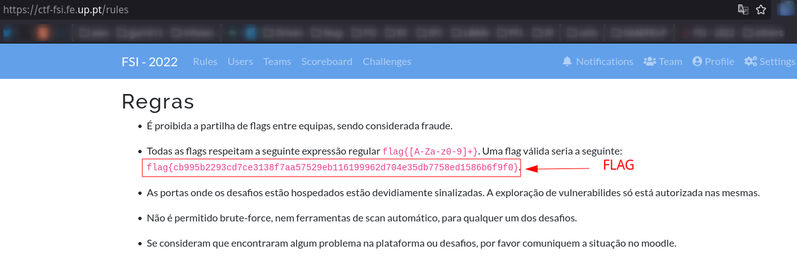
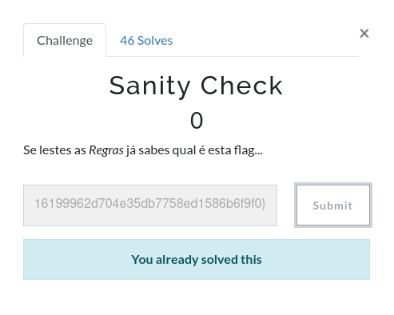

# Trabalho realizado na semana 3

# Caracterização e exploração de vulnerabilidade
## CVE-2014-6271 (ShellShock)


## Identificação:

   - **ShellShock** é um exploit que consiste em correr código remoto em máquinas UNIX (principalmente)
   - Falha de segurança presente em máquinas que correm *bash* das versões 1.14 até 4.3
   - Utilizando código simples como `env x='() { :;}; echo VULNERABLE; exit;’ bash -c ‘echo NOT VULNERABLE’` conseguimos ter *root* da máquina

## Catalogação:

- Descoberta por [Stéphane Chazelas](https://unix.stackexchange.com/users/22565/st%c3%a9phane-chazelas) e comunicada ao mantenedor da Bash a 12 de setembro de 2014
- Divulgada publicamente a 24 de setembro de 2014
- Categorizada com gravidade de 10 na escala de NIST
- Não existe *bug bounty* associada


## Exploit:

   - Esta vulnerabilidade explora o facto de o *bash* conseguir executar novas instâncias de si mesmo, assim como o facto de executar *trailing strings* ao definir variáveis de ambiente
   - Vulnerabilidade do tipo RCE (Remote Code Execution)


## Ataques:
   - Ainda hoje são identificados ataques *ShellShock*
   - O atacante consegue obter *root* da máquina, sendo que pode fazer/executar o que quiser dentro do servidor remotamente

### Exploit: descrever que tipo de exploit é conhecido e que tipo de automação existe, e.g., no Metasploit (max 4 itens com 20 palavras cada)

Para executar uma bash vulnerável a este exploit, podemos executar, numa máquina com Docker instalado, o seguinte comando:

```bash  
`ID="$(docker run -d rohitnss/shellshock)" && echo $ID && docker exec -it $ID /bin/bash && docker rm -f $ID > /dev/null`
```

O comando irá criar um container com a versão da bash vulnerável, executar a bash dentro do container.

Por fim, podemos executar o script de verificação para a vulnerabilidade *ShellShock*:

```bash
env x='() { :;}; echo VULNERABLE; exit;' bash -c "echo 'NOT VULNERABLE'"
```

Para sair do container, basta executar o comando `exit` na bash do container. O container será automaticamente removido.

## CTF - Sanity Check

Após lermos a descrição desta challenge, percebemos imediatamente que a challenge estaria no endpoint [/rules](https://www.ctf-fsi.fe.up.pt/rules).

Tendo isto em conta, para resolver a challenge, o nosso procedimento foi:

### Step 1 - Aceder à secção rules

<p align="center" justify="center">
    
</p>
<p align="center">
    <strong>Fig 1.</strong> Flag no endpoint /rules
</p>

Ao aceder a este endpoint e ler as regras, percebemos que a flag se encontra em cleartext contida numa das regras.

### Step 2 - Submeter a flag

<p align="center" justify="center">
    
</p>
<p align="center">
    <strong>Fig 2.</strong> Submeter a flag
</p>

Após submeter a flag, esta challenge de Sanity Check encontra-se resolvida.