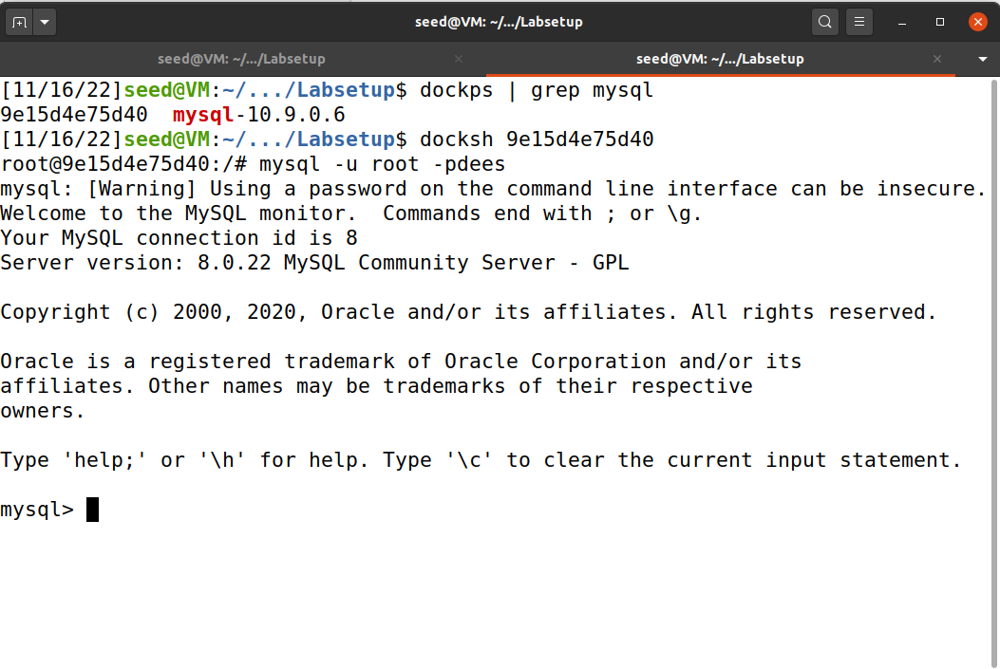
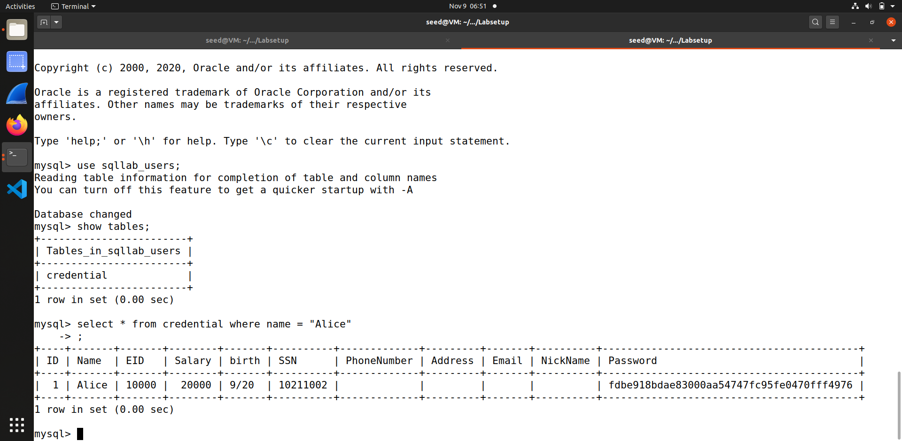
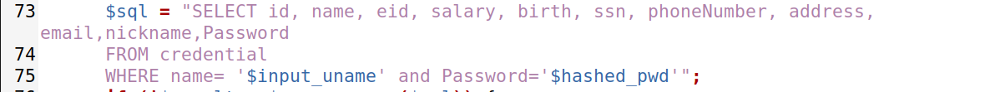
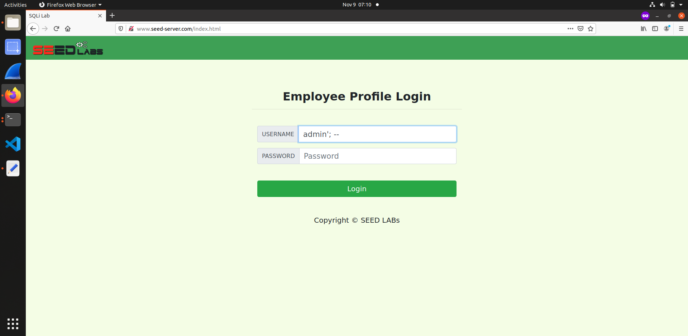
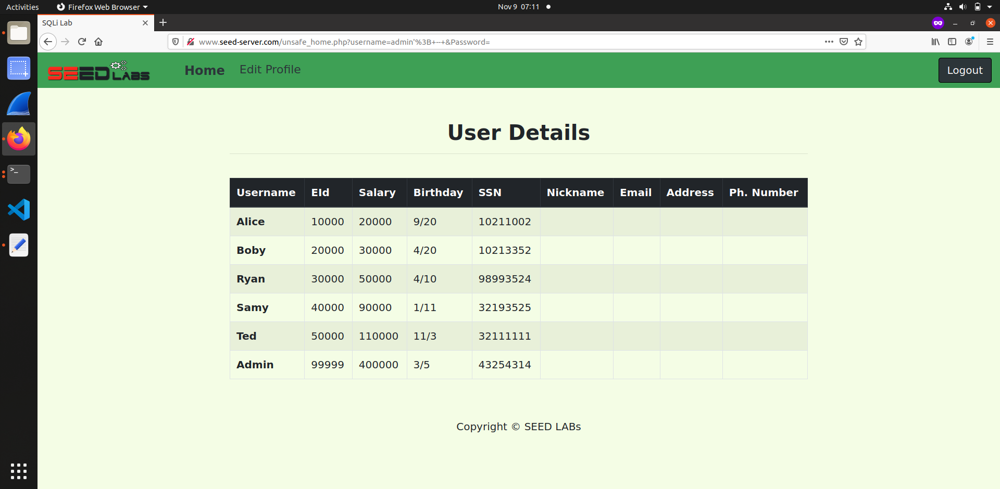
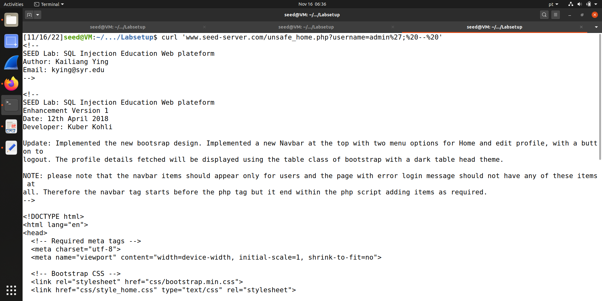
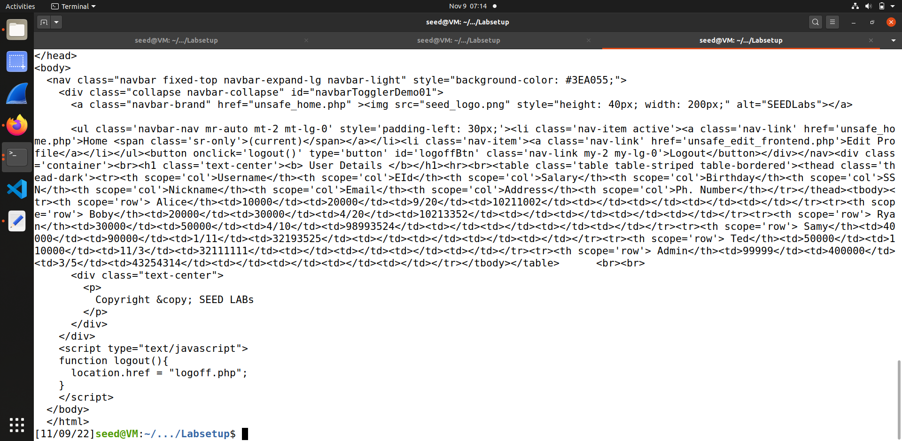
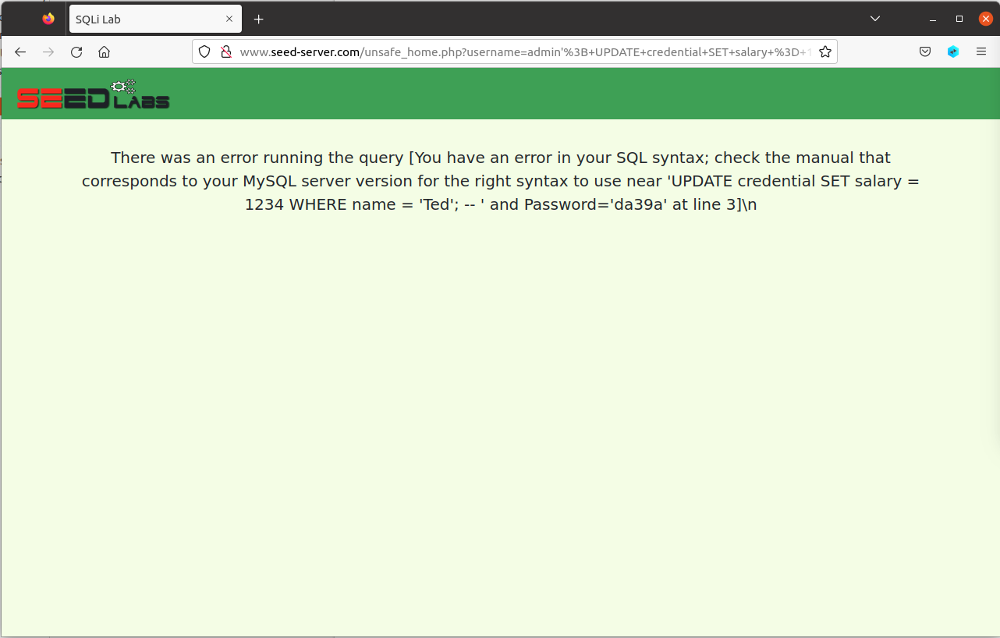
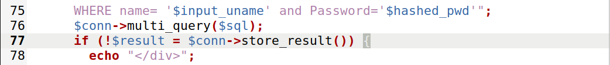
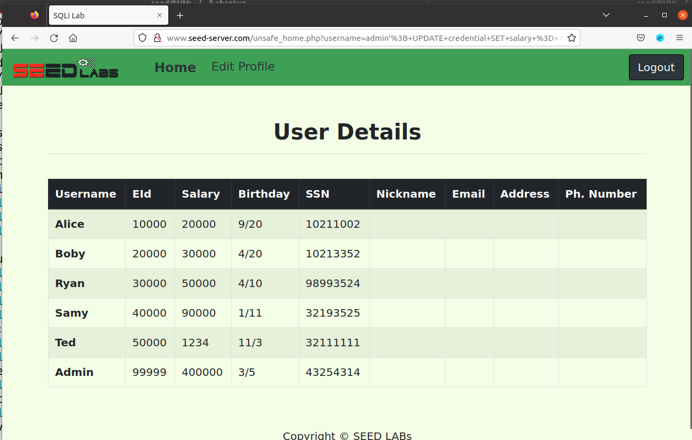

# Trabalho realizado na semana #6

<br>

# SEED Labs - SQL Injection Attack Lab

## Preparation

To prepare our systems for this lab, we followed the Environment Setup section of the guide:

1. Add the entry `10.9.0.5        www.seed-server.com` to the `/etc/hosts` file of your VM.

2. Launch the web server, using `dcup`.
   - This command must be executed in the `Labsetup` directory.

<br>

## Task 1 : Get Familiar with SQL Statements

The goal of this task is to understand the structure of the database that is being used by the web server in the next tasks.

1. Get a shell on the MySQL container.

   1. Use `dockps | grep mysql` to get the id of the container (first column).
   2. Run `docksh <id>` with the id obtained in the previous step (only the first few characters may be used).

2. Get a shell inside the database, by executing `mysql -u root -pdees`.
   
<figure>
   
   <figcaption><strong>Fig 1. </strong>Getting a shell on the MySQL container</figcaption>
</figure>

3. In the database shell:
   
   1. Run `use sqllab_users;` to change the current database to the database named `sqllab_users`.
   2. Run `show tables;` to see a list of the tables in the current database.
   3. Run `select * from credential where name = 'Alice';` to print all of Alice's profile information.

<figure>
   
   <figcaption><strong>Fig 2. </strong>Print all of Alice's profile information</figcaption>
</figure>

<br>

## Task 2 : SQL Injection Attack on SELECT Statement

The goal of this task is to exploit a SQL Injection vulnerability and use that to log in to an arbitrary user account.

First, we'll inspect the code on the server. By going to `Labsetup/image-www/Code/unsafe_home.php`, we can see the code that is used for the home page, which is vulnerable to SQL Injection.

We found the vulnerable SELECT statement and it's presented below:

<figure>
   
   <figcaption><strong>Fig 3. </strong>The vulnerable SELECT statement</figcaption>
</figure>

After finding the vulnerable statement, we did the following steps:
   
1. Looking at the PHP code shown previously, we can see that both the username and the password are injectable. As such, we will use the username since it's the first one to appear in the SQL query, which makes the attack easier to perform.

3. Determine the injection payload:

   - We want to log in with the account of the user named `admin`. We can do that by executing the query `SELECT <fields> FROM credential WHERE name = 'admin';`. In the next steps, we will show how to transform the previously shown query into this one.
  
   1. We do not need the `password` field. To remove it, we can simply comment it out (put `; -- ` before it; the space is needed). This will be placed in the field that comes before `password`, which is `name`. As such, no payload is needed for the `password` field.
   
   2. On the `username` field, we want to select the `admin` account. Furthermore, we also want to introduce the changes described in 1., which means that we must close the string as well. Since the string is opened using `'`, we will need to close it using the same character (`'`). As such, the payload for the `name` field will be `admin'; -- `.
   
   3. The resulting SELECT statement will be as follows:
        ```sql
        SELECT <fields> FROM credential WHERE name = 'admin'; -- ' and Password = '';
        ```

### 1. SQL Injection Attack from webpage

1. Connect to the website on `www.seed-server.com`, where we will be presented with a login page.

2. Fill in the login form with the following inputs:

    - Username: `admin'; -- `
    - Password: *anything you want*

<figure>
   
   <figcaption><strong>Fig 4. </strong>The payload for the SQL Injection attack</figcaption>
</figure>
   
3. Submit the form.
   
<figure>
   
   <figcaption><strong>Fig 5. </strong>Logged in as admin, with SQL Injection</figcaption>
</figure>

### 2. SQL Injection Attack from command line

`curl` is a command-line tool that allows the user to make HTTP requests to any URL. We can, therefore, send our SQL injection payload by using `curl`.

1. Open a terminal.
2. Run `curl "www.seed-server.com/unsafe_home.php?username=admin%27;%20--%20"`.
   
   - Some special characters, such as `'` and spaces need to be encoded when used in a URL. As such, we must use `%20` instead of spaces and `%27` instead of single quotes, which are the corresponding URL-encoded version of those characters.
   
<figure>
   
   
   <figcaption><strong>Figs 6 and 7. </strong>HTML code of admin page, with SQL Injection and curl</figcaption>
</figure>

<br>

### 3. Append a new SQL statement

To execute multiple statements, we can simply add the new statement after the `;` and before the ` -- ` in the username.

As such, if we want to change Ted's salary to 1234, we will need to execute the statement `UPDATE credential SET salary = 1234 WHERE name = 'Ted';`.

This means that the payload will be as follows:

- Username: `admin'; UPDATE credential SET salary = 1234 WHERE name = 'Ted'; -- `
- Password: *anything you want*

If we submit this payload on the webpage, however, we will get an error.

<figure>
   
   <figcaption><strong>Fig 8. </strong>Error after submitting the previous payload</figcaption>
</figure>

This error happens because the server is configured to only execute a single statement per query. To change this, we will need to edit the `unsafe_home.php` file, as shown below.

<figure>
   
   <figcaption><strong>Fig 9. </strong>Code after changes have been applied (lines 75 - 78)</figcaption>
</figure>

With these changes, the server stops using
```php
$conn->query($sql);
```
and instead uses
```php
$conn->multi_query($sql);
```

`multi_query` allows the execution of multiple semicolon-separated statements in the same query, whereas `query` doesn't.

With these changes applied, we need to rebuild the server using `dcup --build`.

After the server is back online, if we submit the payload again, the same user details are shown. This happens because the SELECT statement comes before the UPDATE statement, which means that the changes won't be reflected on the SELECT statement.

To fix this, we can simply reload the page, which will in turn execute the query again and return the updated user details, as shown below.

<figure>
   
   <figcaption><strong>Fig 10. </strong>User details after resubmitting the SQL Injection payload</figcaption>
</figure>

As we can see, Ted's salary has been changed to 1234.

## Task 3 : SQL Injection Attack on UPDATE Statement

