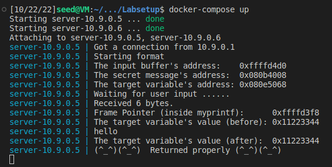
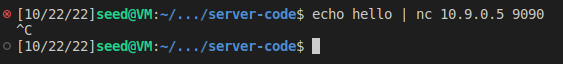

# SEED Labs - Format String Attack Lab
## Task #1

1. Start the docker instance that contains the server with the format string vulnerability with `docker-compose up`

2. Send the string "hello" to the server and see the server logs

Terminal 1 | Terminal 2
:---------:|:---------:
 | 

3. Crash the program by sending the modifier "%n" to the server
    - This modifier prints the number of printed bytes to a specified variable. Since in this case no variable is being specified, the program will search for somewhere to save them, which will be the first address found on the stack.
    - At the moment of the `printf` call, the variable on top of the stack is the frame pointer (points to the beginning of the stack frame) of the function call, which will be overriden and, therefore, the program will crash.

Terminal 1 | Terminal 2
:---------:|:---------:
 | 